# Deposit Account Service (DAS) - ARC42 Architecture Documentation

## Table of Contents
1. [Introduction](#introduction)
2. [Architecture Constraints](#architecture-constraints)
3. [System Scope and Context](#system-scope-and-context)
4. [Solution Strategy](#solution-strategy)
5. [Building Block View](#building-block-view)
6. [Runtime View](#runtime-view)
7. [Deployment View](#deployment-view)
8. [Cross-cutting Concepts](#cross-cutting-concepts)
9. [Architecture Decisions](#architecture-decisions)
10. [Quality Requirements](#quality-requirements)
11. [Risks and Technical Debt](#risks-and-technical-debt)
12. [Product Management](#product-management)
13. [Glossary](#glossary)
14. [Appendix](#appendix)

## 1. Introduction
### Document Goals
This document provides a structured technical overview of the Deposit Account Service (DAS) using the ARC42 template. Its purpose is to support stakeholders, architects, and developers in understanding the architecture and design choices of the DAS module.

### Stakeholders
- **Product Managers**: Define functional and business requirements.
- **Development Teams**: Implement and maintain the service.
- **Security and Compliance Teams**: Ensure GDPR and regulatory compliance.
- **Operations**: Manage deployment, scalability, and monitoring.

## 2. Architecture Constraints
### Regulatory Constraints
- **GDPR Compliance**: Ensures data privacy and protection for users.This version clarifies the regional applicability of GDPR while emphasizing its broader relevance.
- **Financial Regulations**: Aligns with relevant financial regulatory standards for transaction handling and auditing.

### Technical Constraints
- **Data Encryption**: Sensitive data is encrypted both at rest and in transit.
- **Performance**: Must meet specific response time targets for balance inquiries and transaction history requests.

## 3. System Scope and Context
### Business Context
DAS is a backend module within a financial ecosystem, responsible for managing user accounts, balances, and transaction histories. It interfaces with the User Application, OBS (Online Banking Service), and AAS (Account Access Service).
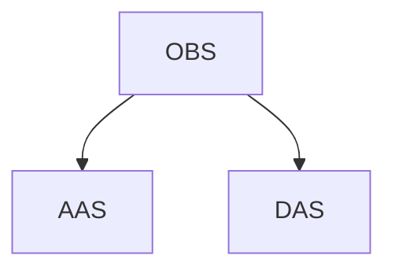
### External Interfaces
- **User Interface**: Provides access for end-users to manage accounts and view balances.
- **Other Services**: Interfaces with OBS and AAS to handle tasks like balance inquiries and transaction retrievals.

## 4. Solution Strategy
DAS utilizes a layered architecture for clear separation of concerns, modularity, and scalability.
The following diagram illustrates the layered approach
- **API Layer**: Exposes RESTful endpoints for external interactions.
- **Service Layer**: Processes business logic for account registration, balance inquiries, and transaction history.
- **Data Layer**: Manages data access, encryption, and storage.

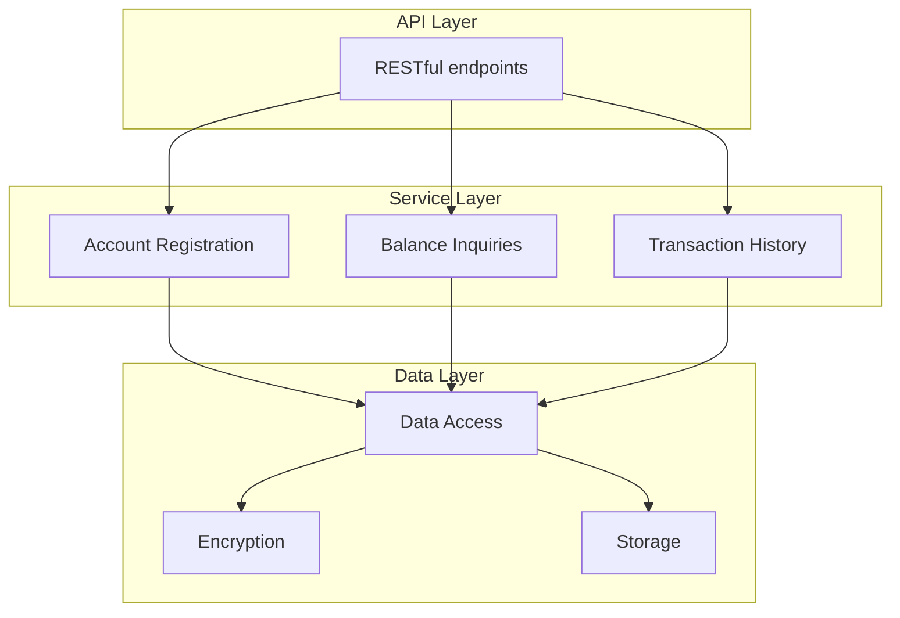
## 5. Building Block View
### Overview
The DAS module is composed of three main components:
- **Account Registration**: Manages account creation and data validation.
- **Balance Inquiry**: Handles real-time balance retrieval.
- **Transaction History**: Logs, retrieves, and filters transaction data.

### Detailed View
**ledgers-bank-account**
*   **ledgers-bank-account-repository:** Handles data persistence for bank accounts, likely interacting with a database.
*   **ledgers-bank-account-service-api:** Defines the interfaces and contracts for bank account services, outlining the operations that can be performed.
*   **ledgers-bank-account-service-impl:** Provides the concrete implementation of the bank account services, carrying out the actual business logic.
*   **ledgers-bank-account-rest-api:**  Specifies the RESTful API endpoints for interacting with bank accounts, defining the resources and operations available to external systems.
*   **ledgers-bank-account-rest-server:** Implements the REST API, handling HTTP requests and responses related to bank accounts.
*   **ledgers-bank-account-rest-client:** Offers a client library for consuming the bank account REST API, facilitating integration with other services.

**webank-utils**
The following scenario illustrates the balance inquiry process.
This module likely contains utility functions and helper classes that are shared across different parts of your web banking application. It's divided into:

*   **webank-api-utils:** Provides utilities specifically for working with APIs, such as request/response handling, data transformation, or authentication.
*   **webank-server-utils:**  Contains utilities for server-side operations, such as configuration management, logging, or security.

**Illustrative Diagram**
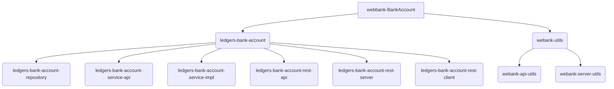

### Deployment Strategy

#### Microservices
Each of these components (OBS, DAS, and AAS) will be deployed as a separate microservice, enabling independent scaling and maintenance.

In some resource-constrained environments, the application also offers the possibility to bundle all three components (OBS, DAS, and AAS) and deploy them as a single application.

Here's what I changed:

* **Clarity:**  Clarified that AAS is the third component, not PRS (assuming this was a typo).
* **Word choice:** Replaced "scarse environment" with "resource-constrained environments" for better precision.
* **Consistency:**  Used "deploy them" instead of "deploy as" to maintain grammatical consistency.

This improved version enhances readability and ensures accurate information about your deployment options.

#### Single App Deployment

In a single-app deployment, all three components (OBS, DAS, and AAS) are packaged and deployed together as one application. This means they run within the same process and share resources like memory and CPU. This contrasts with the microservices approach where each component is deployed independently.

**Advantages of Single App Deployment**

* **Simplified Environment Management:**  Dealing with one application is inherently simpler than managing three separate deployments. This reduces operational overhead, especially in environments with limited resources or expertise.
* **Reduced Infrastructure Costs:**  Running a single application can be more cost-effective as it requires fewer server instances and associated infrastructure.
* **Easier Debugging and Troubleshooting:**  Having all components in one place makes it easier to trace issues and debug problems.
* **Improved Performance (potentially):**  In some cases, communication between components within a single application can be faster than inter-service communication in a microservices architecture, potentially leading to performance gains.

**Component Diagram**
The following diagram depicts all three components residing within a single application node, illustrating the monolithic deployment approach.

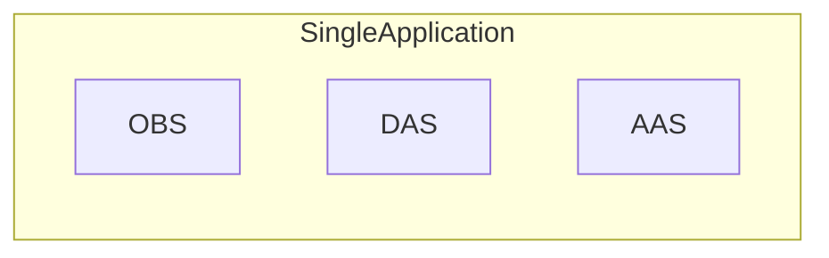

**Important Considerations**

While single-app deployment offers advantages, it's crucial to weigh them against the benefits of microservices, such as independent scaling, technology diversity, and fault isolation.

#### Cloud Infrastructure

*   **Platform (AWS):**  Excellent choice! AWS provides a comprehensive suite of services for building and running applications. You can further specify the specific AWS services used (e.g., EC2 for compute, S3 for storage, RDS for databases).
*   **Load Balancing (ELB):**  ELB is crucial for distributing traffic and ensuring high availability. Consider mentioning the specific ELB type used (Application Load Balancer, Network Load Balancer, or Classic Load Balancer) and any configurations (e.g., health checks, listener rules).
*   **Scaling (Auto Scaling):** Auto Scaling is essential for dynamically adjusting capacity. Elaborate on the scaling policies configured (e.g., target tracking, step scaling, scheduled scaling) and the metrics used for scaling decisions (CPU utilization, request count, etc.).

**Container Orchestration (Kubernetes)**

*   **Kubernetes (K8s):** Kubernetes is the industry-standard for container orchestration.  It's worth mentioning the specific Kubernetes distribution used (e.g., Amazon EKS, self-managed K8s).
*   **Clusters and Nodes:**  Clearly defines the basic K8s concepts. You can add details about the node types (e.g., instance types, operating system) and the cluster size (number of nodes).
*   **Horizontal Pod Autoscaling (HPA):** HPA is a key feature for automatic scaling. Specify the metrics and thresholds used for scaling pods (e.g., CPU utilization above 70%).
*   **Service Discovery and Load Balancing:** Kubernetes Services are essential for inter-service communication. You can mention the service types used (ClusterIP, NodePort, LoadBalancer) and how service discovery is implemented (DNS, environment variables).

**Diagram**

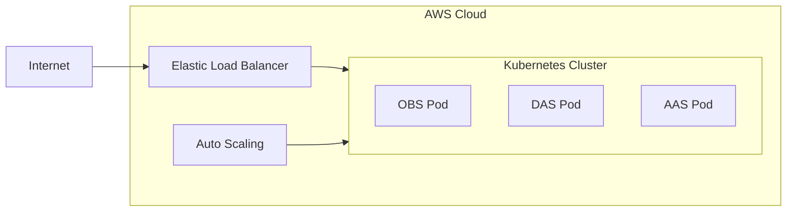

This diagram provides a visual representation of your cloud deployment:

*   **AWS Cloud:** Represents the overall AWS environment.
*   **ELB:** Shows the entry point for incoming traffic.
*   **Kubernetes Cluster:** Depicts the K8s cluster with your three component pods.
*   **Auto Scaling:** Illustrates the dynamic scaling of the K8s cluster.

#### CI/CD Pipelines

The CI/CD pipeline for DAS employs a robust and automated workflow to streamline the building and testing of the application. This approach ensures rapid and reliable delivery of updates while maintaining high code quality and minimizing manual intervention. The pipeline utilizes a GitOps approach for deployment, which will be elaborated upon in the following section.

*   **Pipeline Overview:** The pipeline is designed to optimize the development process for DAS, a Spring Boot application with an RDBMS backend. It leverages GitHub as the source code repository and GitHub Actions for orchestrating the CI/CD workflow. The primary goals are to accelerate release cycles, increase deployment frequency, improve code quality, and reduce manual effort.
*   **Tools:** GitHub Actions forms the core of the CI/CD pipeline, providing a comprehensive platform for defining and executing automated workflows. It seamlessly integrates with GitHub's repository features and offers a wide range of actions for building, testing, and deploying applications.  Additional tools may include:
    *   Build tools for Spring Boot applications (e.g., Maven, Gradle)
    *   Testing frameworks (e.g., JUnit, Mockito)
    *   Code quality tools (e.g., SonarQube, Code Climate)
    *   Database migration tools (e.g., Flyway, Liquibase)
    *   Docker for containerization
*   **Build Stage:** Triggered by code commits or pull requests, the build stage compiles the DAS application code, runs any necessary pre-build steps (e.g., code generation), and packages the application into a Docker image. This image is then pushed to a secure container registry, such as AWS ECR, for later deployment.
*   **Test Stage:**  Automated tests are executed in parallel to validate the changes introduced in the build. This includes various levels of testing:
    *   **Unit Tests:** Verify individual components and methods within the application.
    *   **Integration Tests:**  Assess interactions between different modules and services.
    *   **End-to-End Tests:**  Simulate real-world scenarios and user interactions to ensure the application functions correctly as a whole.
    *   **Database Integration Tests:** Validate the application's interaction with the RDBMS, including data access and persistence operations.
    Any test failures halt the pipeline, preventing faulty code from being deployed.

#### Deployment with GitOps

The deployment of DAS to the Kubernetes environment is managed using a GitOps approach. This involves storing all Kubernetes configuration files (deployments, services, etc.) in a Git repository, which serves as the single source of truth for the desired state of the application. A GitOps operator continuously monitors this repository and automatically applies any changes to the cluster. This pull-based deployment strategy enhances security and simplifies rollbacks. (Refer to the "GitOps in Kubernetes for DAS" section below for a detailed explanation.) 

#### Build Process Diagram

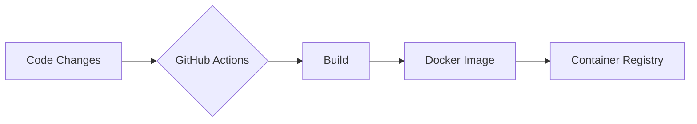

This diagram outlines the key steps in the build process:

*   **Code Changes:** Represents any modifications to the application's source code.
*   **GitHub Actions:**  Indicates that GitHub Actions is orchestrating the build process.
*   **Build:** Encompasses the compilation, testing, and packaging of the application.
*   **Docker Image:** Shows the creation of a Docker image containing the application.
*   **Container Registry:** Represents the storage of the Docker image in a registry (e.g., AWS ECR).

#### Deployment Process Diagram (GitOps)

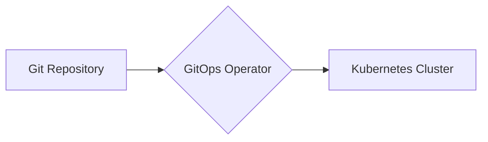

This diagram illustrates the GitOps deployment process:

*   **Git Repository:** Represents the Git repository containing the Kubernetes configuration files.
*   **GitOps Operator:**  Indicates the tool (e.g., Argo CD, Flux) that monitors the repository and applies changes.
*   **Kubernetes Cluster:** Shows the target environment where the application is deployed.

#### Monitoring Architecture Inputs

*   **Metrics Sources:**
    *   **Application Metrics:**  Gather key metrics from the DAS application itself, such as request latency, error rates, transaction throughput, and resource consumption (CPU, memory, threads).
    *   **Kubernetes Metrics:** Collect metrics from the Kubernetes cluster, including pod health, resource utilization (CPU, memory, network), and deployment status.
    *   **Database Metrics:** Monitor database performance, including query execution times, connection pool usage, and database server health.

*   **Monitoring Tools:**
    *   **CloudWatch:**  Utilize CloudWatch for collecting and visualizing system metrics, setting alarms for critical events, and creating dashboards for monitoring overall application health.
    *   **Prometheus:**  Employ Prometheus for collecting, storing, and querying time-series metrics, enabling advanced monitoring and alerting capabilities.

*   **Alerting:**
    *   **Threshold-based Alerts:** Configure alerts in CloudWatch or Prometheus to trigger notifications when specific metrics exceed predefined thresholds (e.g., high CPU utilization, low disk space).
    *   **Anomaly Detection:** Implement anomaly detection mechanisms to identify unusual patterns in metrics and trigger alerts for potential issues.

#### Diagram for Monitoring

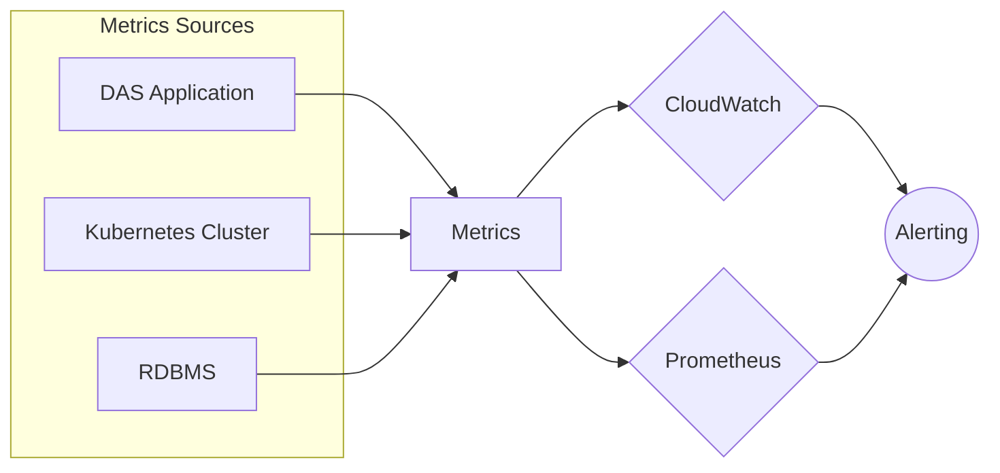

#### Logging Architecture Inputs

*   **Log Sources:**
    *   **Application Logs:** Capture logs generated by the DAS application, including information about API requests, database interactions, and internal events.
    *   **Kubernetes Logs:** Collect logs from Kubernetes components, such as pods, containers, and the control plane.
    *   **Database Logs:**  Gather logs from the database server, including error logs, query logs, and audit logs.

*   **Logging Tools:**
    *   **CloudWatch Logs:** Utilize CloudWatch Logs for collecting, storing, and analyzing log data.
    *   **ELK Stack (Elasticsearch, Logstash, Kibana):** Employ the ELK stack for centralized log management, providing advanced search, visualization, and analysis capabilities.

*   **Log Processing:**
    *   **Log Aggregation:**  Aggregate logs from all sources into a centralized location (CloudWatch Log Groups or Elasticsearch).
    *   **Log Parsing and Enrichment:** Parse log messages to extract relevant information and enrich them with additional context (e.g., timestamps, hostnames).
    *   **Log Analysis:**  Analyze log data to identify patterns, trends, and anomalies, and gain insights into application behavior and potential issues.

#### Mermaid Diagram for Logging

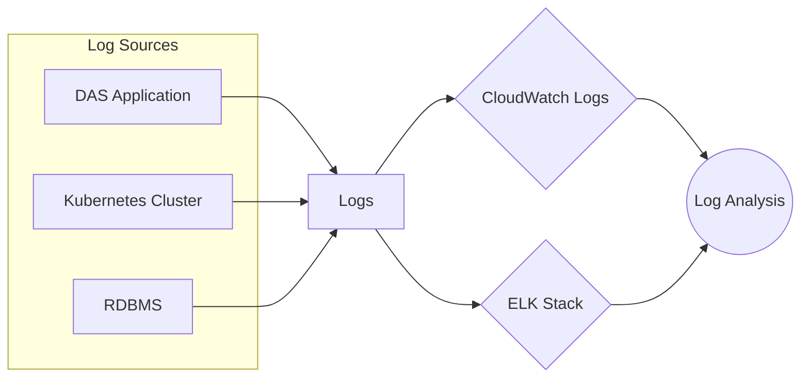

#### Security Architecture

Security in the DAS application is paramount and is built upon the following core principles:

*   **Decentralized and Declarative Access Control:** Access control is enforced directly within the service layer (e.g., `ledgers-account-service-impl`) and is entirely declarative. This means that access permissions are defined by associating accessor public keys with the resources they are allowed to access in a dedicated access control database. The presented credential serves as an attestation of this right, eliminating the need for real-time checks against the access database during authorization.

*   **Public Key-Based Authentication:**  DAS handles user authentication directly, relying on public key cryptography.  Accounts are linked to accessor public keys. Access is granted based on:
    *   **Signed Credentials (SD-JWT):** Issued by DAS to authenticated users, these credentials assert the user's identity and their associated public key.
    *   **Request Presentations:** For each request, the accessor must sign a presentation containing the request's hash. This presentation is included in the `Authorization` header.

*   **Request Signing and Verification:** DAS verifies the signature on the presentation to authenticate the requestor. This confirms that the request originates from the claimed accessor and hasn't been tampered with.

*   **Comprehensive Logging:** All requests, along with their associated presentations, are meticulously logged for auditing and security analysis. This creates a detailed audit trail for identifying potential security breaches or suspicious activities.

*   **Revocation Handling:**  A revocation database maintains a list of revoked credentials that haven't expired. This database is also held in memory for faster access, ensuring revoked credentials are promptly identified and rejected.

**Data Encryption**

Encryption remains crucial for protecting sensitive data:

*   **TLS/SSL for Transport Encryption:** All communication between clients and DAS, as well as inter-service communication, is secured using TLS/SSL to safeguard data in transit.
*   **Encryption at Rest:** Sensitive data in databases or persistent storage is encrypted to protect against unauthorized access in case of data breaches.

#### Diagram for Request Flow with Security

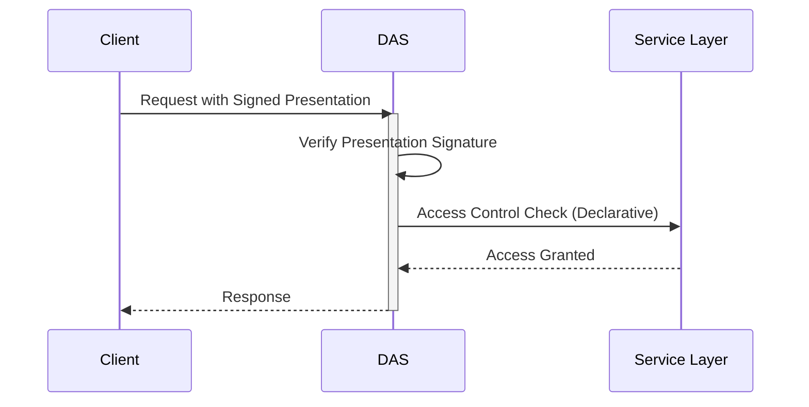
#### Diagram for Security Components
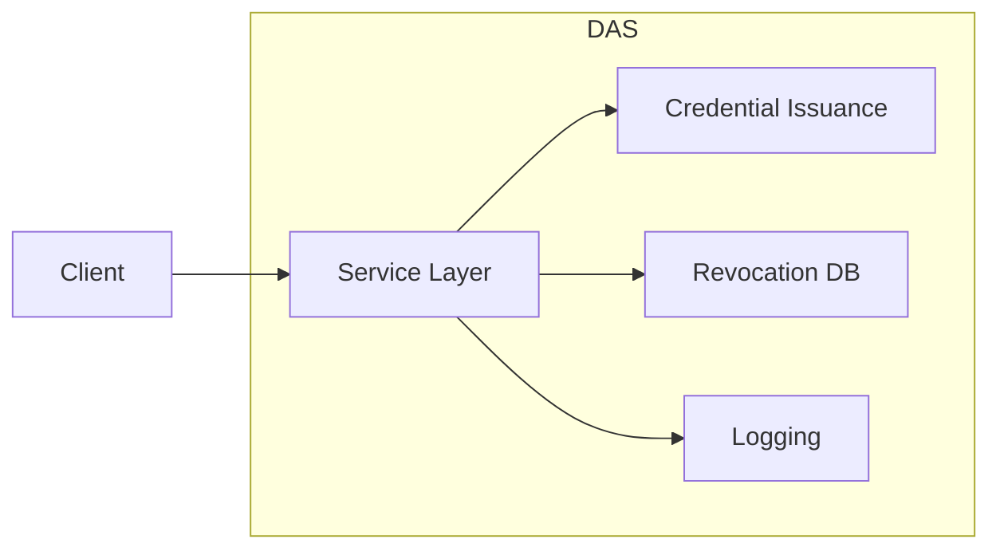

#### Data Encryption

Encryption remains crucial for protecting sensitive data:

*   **TLS/SSL for Transport Encryption:** All communication between clients and DAS, as well as inter-service communication, is secured using TLS/SSL to safeguard data in transit.
*   **Encryption at Rest:** Sensitive data in databases or persistent storage is encrypted to protect against unauthorized access in case of data breaches.

#### Diagram for Request Flow with Security

*   **Test Stage:**  Automated tests are executed in parallel to validate the changes introduced in the build. This includes various levels of testing:
    *   **Unit Tests:** Verify individual components and methods within the application.
    *   **Integration Tests:**  Assess interactions between different modules and services.
    *   **End-to-End Tests:**  Simulate real-world scenarios and user interactions to ensure the application functions correctly as a whole.
    *   **Database Integration Tests:** Validate the application's interaction with the RDBMS, including data access and persistence operations.
    Any test failures halt the pipeline, preventing faulty code from being deployed.

**Deployment with GitOps**

The deployment of DAS to the Kubernetes environment is managed using a GitOps approach. This involves storing all Kubernetes configuration files (deployments, services, etc.) in a Git repository, which serves as the single source of truth for the desired state of the application. A GitOps operator continuously monitors this repository and automatically applies any changes to the cluster. This pull-based deployment strategy enhances security and simplifies rollbacks. (Refer to the "GitOps in Kubernetes for DAS" section below for a detailed explanation.) 

**Build Process Diagram**

- **Data Layer**: Manages interactions with the database for account and transaction data.
 

## 6. Runtime View
### Balance Inquiry Scenario
1. The App sends a balance request to OBS.
2. OBS validates the account with AAS.
3. AAS retrieves the account ID and forwards it to DAS.
4. DAS returns the balance through AAS and OBS to the App.

The following scenario illustrates the balance inquiry process. 

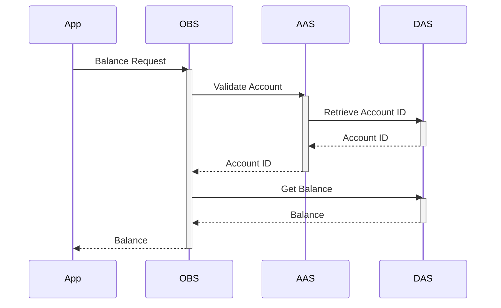

### Key Scenarios
- **Account Registration**: User initiates account creation, and the system validates, stores, and confirms data.
- **Transaction History Retrieval**: User requests a filtered transaction history, which DAS retrieves accordingly.

## 7. Deployment View
### Deployment Strategy
#### Cloud Infrastructure
- **Platform**: DAS is deployed on Amazon Web Services (AWS), which provides a reliable and scalable cloud environment with high availability and security.
- **Load Balancing**: AWS Elastic Load Balancing (ELB) distributes incoming application traffic across multiple instances to ensure availability and resilience. It automatically adjusts to traffic demands, which helps maintain optimal performance during peak usage.
- **Scaling**: AWS Auto Scaling is implemented to monitor system performance and automatically adjust capacity as needed, scaling up during high-demand periods and down when demand decreases. This ensures efficient use of resources and cost management.

#### Container Orchestration
- **Kubernetes (K8s)**: DAS is containerized and managed using Kubernetes, which facilitates automated deployment, scaling, and management of containerized applications.
- **Clusters and Nodes**: The Kubernetes cluster comprises multiple nodes that host the containerized microservices. Each service, such as the API Layer, Service Layer, and Data Layer, is deployed as a Kubernetes Pod.
- **Horizontal Pod Autoscaling**: Kubernetes enables Horizontal Pod Autoscaling (HPA) based on CPU or memory utilization, dynamically scaling the number of pods to meet current demand.
- **Service Discovery and Load Balancing**: Kubernetes services provide internal load balancing within the cluster and manage communication between pods, ensuring seamless and reliable inter-service communication.

#### CI/CD Pipelines
- **Pipeline Overview**: Continuous Integration and Continuous Deployment (CI/CD) pipelines are set up to automate building, testing, and deployment processes, reducing manual intervention and ensuring rapid, reliable delivery of updates.
- **Tools**: The CI/CD pipelines are configured with tools such as Jenkins, GitLab CI/CD, or GitHub Actions for automated workflows, integrating with AWS and Kubernetes for seamless deployment.
- **Build Stage**: The pipeline triggers builds upon code commits or pull requests, creating Docker images for each service in DAS and pushing them to a secure container registry (e.g., AWS Elastic Container Registry (ECR)).
- **Test Stage**: Automated tests (unit, integration, and end-to-end) run in parallel to validate changes. Any failures stop the deployment process, ensuring only fully tested code reaches production.
- **Deployment Stage**: Upon passing all tests, Kubernetes deployments are triggered, and updated containers are rolled out. Kubernetes Rolling Updates ensure zero-downtime deployment by gradually replacing instances without affecting live traffic.

#### Monitoring and Logging
- **Monitoring**: Amazon CloudWatch and Prometheus are used for monitoring system performance, tracking key metrics (CPU, memory, request rates), and identifying any issues early. Kubernetes also provides native metrics for pod health and resource usage.
- **Logging**: AWS CloudWatch Logs or ELK Stack (Elasticsearch, Logstash, Kibana) captures and organizes logs for audit, security, and troubleshooting. Logs are centralized to provide insights across all microservices and help detect anomalies or performance bottlenecks.

## 8. Cross-cutting Concepts
### Security
- **Authentication and Authorization**: Keycloak provides user authentication and authorization services.
- **Data Encryption**: All sensitive data is encrypted in transit and at rest.
- **Access Control**: Role-based access control (RBAC) is enforced for sensitive data.

### Performance Optimization
- **Caching and Indexing**: Implemented for commonly accessed data, such as balances and transaction histories.

### Error Handling
- **Logging and Alerts**: All errors are logged, and alerts are generated for critical issues in real-time.

## 9. Architecture Decisions
- **Layered Architecture**: For modularity and separation of concerns.
- **RESTful API**: Ensures broad compatibility with external services.
- **Data Encryption**: Mandatory for security and compliance with regulations.
- **GDPR Compliance**: User data is handled securely, respecting user privacy.

## 10. Quality Requirements
### Functional Requirements
- Account Registration, Balance Inquiry, and Transaction History retrieval.

### Non-Functional Requirements
- **Performance**: Low-latency responses.
- **Security**: Strong encryption and user data protection.
- **Usability**: User-friendly API design.

## 11. Risks and Technical Debt
- **Risks**: Includes data breach concerns and potential performance bottlenecks with high transaction volume.
- **Technical Debt**: Service module refactoring as DAS scales, and integration challenges with legacy systems.

## 12. Product Management
### Technology Stack
DAS is developed with Java, Spring Boot, ReactJS, TypeScript, TailwindCSS, AWS, Kubernetes, and Keycloak for a robust and secure environment.

## 13. Glossary
- **DAS**: Deposit Account Service
- **OBS**: Online Banking Service
- **AAS**: Account Access Service
