# Deposit Account Service (DAS) - ARC42 Architecture Documentation

## Table of Contents
1. [Introduction](#introduction)
2. [Architecture Constraints](#architecture-constraints)
3. [System Scope and Context](#system-scope-and-context)
4. [Solution Strategy](#solution-strategy)
5. [Building Block View](#building-block-view)
6. [Runtime View](#runtime-view)
7. [Deployment View](#deployment-view)
8. [Cross-cutting Concepts](#cross-cutting-concepts)
9. [Architecture Decisions](#architecture-decisions)
10. [Quality Requirements](#quality-requirements)
11. [Risks and Technical Debt](#risks-and-technical-debt)
12. [Product Management](#product-management)
13. [Glossary](#glossary)
14. [Appendix](#appendix)

## 1. Introduction
### 1.1 Document Goals
This document provides a structured technical overview of the Deposit Account Service (DAS) using the ARC42 template. Its purpose is to support stakeholders, architects, and developers in understanding the architecture and design choices of the DAS module.

### 1.2 Stakeholders
- **Product Managers**: Define functional and business requirements.
- **Development Teams**: Implement and maintain the service.
- **Security and Compliance Teams**: Ensure GDPR and regulatory compliance.
- **Operations**: Manage deployment, scalability, and monitoring.

## 2. Architecture Constraints
### 2.1 Regulatory Constraints
- **GDPR Compliance**: Ensures data privacy and protection for users.This version clarifies the regional applicability of GDPR while emphasizing its broader relevance.
- **Financial Regulations**: Aligns with relevant financial regulatory standards for transaction handling and auditing.

### 2.2 Technical Constraints
- **Data Encryption**: Sensitive data is encrypted both at rest and in transit.
- **Performance**: Must meet specific response time targets for balance inquiries and transaction history requests.

## 3. System Scope and Context

### 3.1 Business Context
DAS is a backend module within a financial ecosystem, responsible for managing user accounts, balances, and transaction histories.

### 3.2 External Components
- **User App**: Provides access for end-users to manage accounts and view balances.
- **OBS (Online Banking Service)**: This is the application that prepares information for the User App.
- **PRS (Person Registration Service)**: Backend module responsible for the registration and management of person records.

### 3.3 Component Diagram
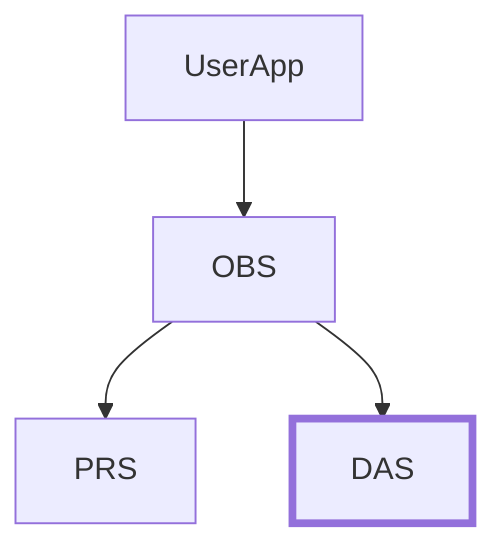

## 4. Solution Strategy
DAS utilizes a layered architecture for clear separation of concerns, modularity, and scalability.
The following diagram illustrates the layered approach
- **API Layer**: Exposes RESTful endpoints for external interactions.
- **Service Layer**: Processes business logic for account registration, balance inquiries, and transaction history.
- **Data Layer**: Manages data access, encryption, and storage.

The DAS module can be integrated either as a standalone module, in which case the host module will access it through the service layer, or it can be integrated into a client module, which will access it through the API layer.

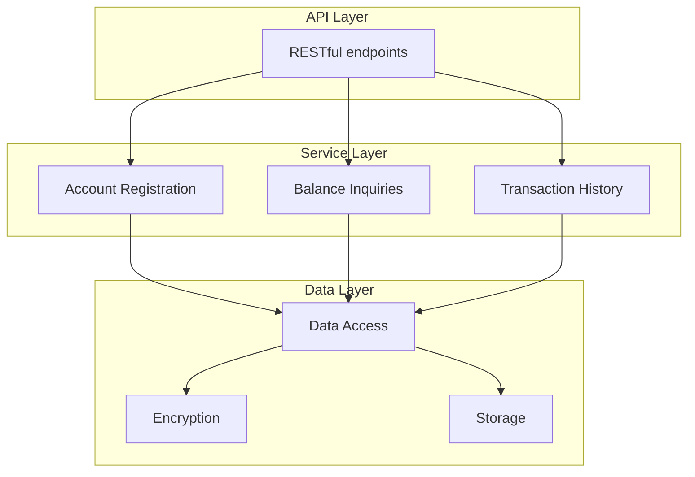

## 5. Building Block View
### 5.1 Overview
The DAS module is composed of three main components:
- **Account Registration**: Manages account creation and data validation.
- **Balance Inquiry**: Handles real-time balance retrieval.
- **Transaction History**: Logs, retrieves, and filters transaction data.

### 5.2 Detailed View

In terms of Java modules, DAS contains the following artifacts.

**ledgers-bank-account**
*   **ledgers-bank-account-repository:** Handles data persistence for bank accounts, likely interacting with a database.
*   **ledgers-bank-account-service-api:** Defines the interfaces and contracts for bank account services, outlining the operations that can be performed. An embedding module accesses DAS through these interfaces.
*   **ledgers-bank-account-service-impl:** Provides the concrete implementation of the bank account services, carrying out the actual business logic and access control logic.
*   **ledgers-bank-account-rest-api:**  Specifies the RESTful API endpoints for interacting with bank accounts, defining the resources and operations available to external systems. A remote module accesses DAS through endpoints defined in this module.
*   **ledgers-bank-account-rest-server:** Implements the REST API, handling HTTP requests and responses related to bank accounts.
*   **ledgers-bank-account-rest-client:** Offers a client library for consuming the bank account REST API, facilitating integration with other services.

**webank-utils**
This module contains utility functions and helper classes that are shared across different parts of the banking application. It's divided into:

*   **webank-api-utils:** Provides utilities specifically for APIs modules. Does not contain heavy implementation routines, as API modules can stay light.
*   **webank-server-utils:**  Contains utilities for implementation modules.

**Illustrative Diagram**
The following diagram contains the dependency tree as defined by the current state of the application.

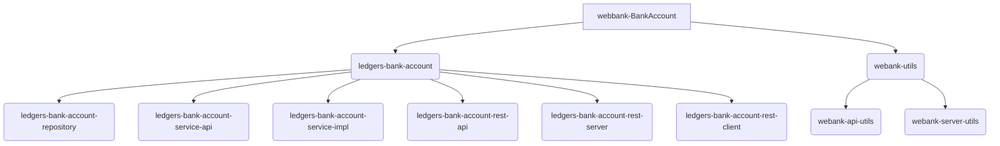


## 6. Runtime View

This section describes how the system behaves at runtime, detailing the interactions between components and the flow of events in various scenarios.

The following scenarios illustrate key interactions within the system:

### 6.1 Registration of a New Account

* **Registration of New Account**

    1.  The user installs the app on their device.
    2.  The user enters their phone number in the app.
    3.  The app generates a key pair for the user.
    4.  The app sends a registration request (phone number, public key) to the OBS.
    5.  The OBS forwards the request to the PRS.
    6.  The PRS sends an OTP (One-Time Password) to the user's phone number via an SMS gateway.
    7.  The app reads the OTP (either automatically or manually entered by the user).
    8.  The app sends the OTP to the OBS for verification.
    9.  The OBS forwards the OTP to the PRS.
    10. The PRS verifies the OTP against the pending registration record.
    11. The OBS requests the DAS to create a new account with an initial balance.
    12. The DAS creates the account and returns the account ID and balance to the OBS.
    13. The OBS requests the AAS to create an account access record (linking the phone number, public key, and account ID).
    14. The AAS creates the access record and returns the balance to the OBS.
    15. The OBS sends the balance to the app.

**Registration Sequence Diagram**

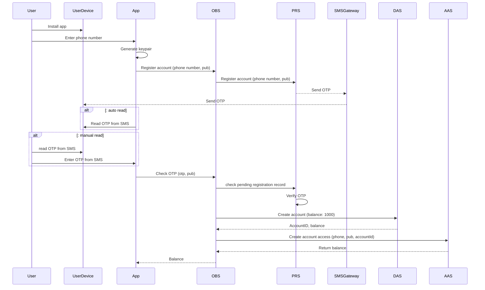

### 6.2 Check Balance

* **Check Balance**

    1.  The user navigates to the dashboard in the app.
    2.  The app sends a balance request (account ID) to the OBS.
    3.  The OBS validates the account with the AAS.
    4.  The AAS retrieves the account details from the DAS.
    5.  If the account is valid, the OBS retrieves the balance from the DAS.
    6.  The OBS sends the balance back to the app.
    7.  The app displays the balance to the user.

**Check Balance Sequence Diagram**

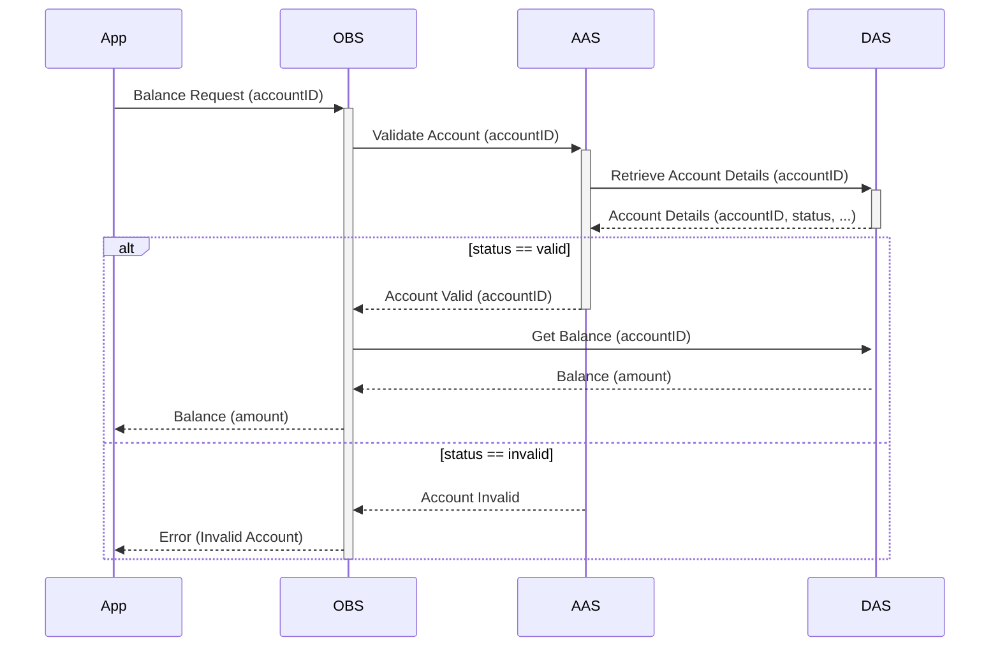

### 6.3 List Transactions

* **List Transactions**

    1.  The user navigates to the "Transactions" section in the app.
    2.  The app sends a request (account ID) to the OBS to fetch the transaction history.
    3.  The OBS retrieves the transactions from the DAS.
    4.  The OBS sends the transaction history back to the app.
    5.  The app displays the transactions to the user.

**List Transactions Sequence Diagram**

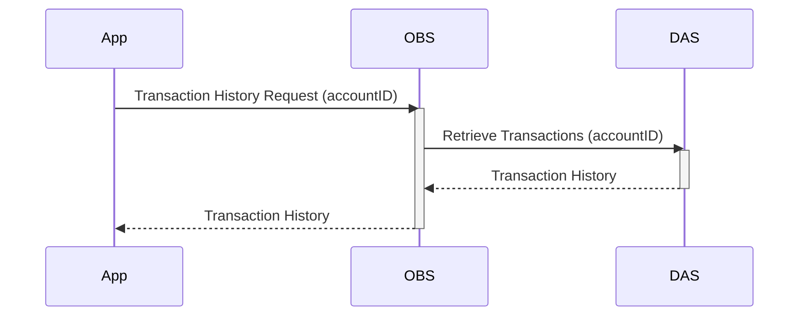

### 6.4 Runtime Qualities

* **Performance:** The system is designed to provide low-latency responses, especially for critical operations like balance checks and transactions.
* **Scalability:** The microservices architecture allows for independent scaling of components to handle increased load.
* **Availability:**  Redundancy and failover mechanisms are implemented to ensure high availability.
* **Security:**  Security is a primary concern, with measures like encryption, authentication, authorization, and input validation implemented throughout the system.


## 7. Deployment View

### 7.1 Deployment Strategy

#### Single App Deployment Scenario

In a single-app deployment, all three components (OBS, DAS, and PRS) are packaged and deployed together as one application. This means they run within the same process and share resources like memory and CPU. This contrasts with the microservices approach where each component is deployed independently.

**Advantages of Single App Deployment**

* **Simplified Environment Management:**  Dealing with one application is inherently simpler than managing three separate deployments. This reduces operational overhead, especially in environments with limited resources or expertise.
* **Reduced Infrastructure Costs:**  Running a single application can be more cost-effective as it requires fewer server instances and associated infrastructure.
* **Easier Debugging and Troubleshooting:**  Having all components in one place makes it easier to trace issues and debug problems.
* **Improved Performance (potentially):**  In some cases, communication between components within a single application can be faster than inter-service communication in a microservices architecture, potentially leading to performance gains.

**Component Diagram**
The following diagram depicts all three components residing within a single application node, illustrating the monolithic deployment approach.

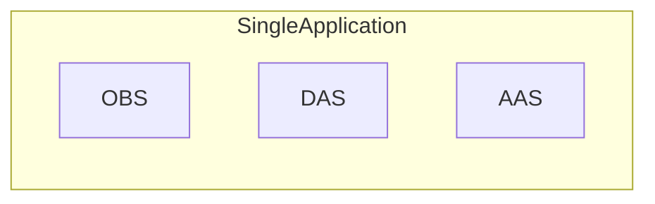

#### Multi-App Deployment Scenario (Microservices)

In a multi-app deployment, each of the three components (OBS, DAS, and PRS) is packaged and deployed as a separate, independent microservice. This means they run in their own processes, potentially on different servers, and communicate with each other over a network.

**Advantages of Multi-App Deployment**

* **Independent Scalability:** Each microservice can be scaled independently based on its specific needs and load. This allows for efficient resource utilization and responsiveness to varying demands.
* **Technology Diversity:** Each microservice can be developed and deployed using the technology best suited for its function, providing flexibility and allowing you to leverage different programming languages, frameworks, and databases.
* **Fault Isolation:** If one microservice fails, the others can continue to operate, improving the overall resilience and availability of the system.
* **Easier Updates and Deployments:**  Individual microservices can be updated and deployed independently without affecting other parts of the system, enabling faster iteration and continuous delivery.

**Component Diagram**

The following diagram depicts each component as a separate service, illustrating the distributed nature of the microservices deployment approach.

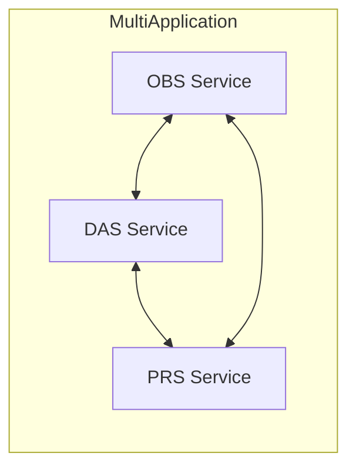

**Considerations for Multi-App Deployment**

* **Increased Complexity:** Managing multiple deployments and their interactions can be more complex than a single-app approach.
* **Network Communication Overhead:** Communication between microservices involves network calls, which can introduce latency and potential points of failure.
* **Data Consistency:** Maintaining data consistency across multiple databases can require careful design and implementation.
* **Monitoring and Observability:** Effective monitoring and observability are crucial in a microservices architecture to track performance, identify issues, and ensure the health of the system.

### 7.2 Cloud Infrastructures

#### Cloud Infrastructure : AWS Example

**1. Cloud Provider: AWS**

While this example uses AWS for its ease of use and wide range of services, the application can be deployed on other cloud platforms like Azure, GCP, or Digital Ocean, or even on-premises infrastructure, with appropriate adjustments to the specific services and configurations.

**2. Compute: AWS Elastic Container Service (ECS)**

* **ECS Cluster:** Create a single ECS cluster to host your microservices.
* **Task Definitions:** Define three separate task definitions, one for each microservice. Each task definition specifies the Docker image for the microservice, resource requirements (CPU, memory), and port mappings.
* **Services:** Create three ECS services, one for each microservice. Each service will manage the desired number of tasks (containers) for its respective microservice.

**3. Networking: AWS Application Load Balancer (ALB)**

* **ALB:** Use an Application Load Balancer to distribute incoming traffic to your microservices.
* **Target Groups:** Create three target groups, one for each microservice. Each target group will register the tasks (containers) running the corresponding microservice.
* **Listener Rules:** Configure listener rules on your ALB to route traffic to the appropriate target group based on the request path or other criteria.

**4. Storage: Amazon RDS**

* **Database:** Choose a suitable database service like Amazon RDS for MySQL, PostgreSQL, or another database that fits your needs.
* **Separate Databases:** Consider using separate databases for each microservice to promote loose coupling and independent scaling.

**5. Scaling: ECS Service Auto Scaling**

* **Auto Scaling Policies:** Configure auto scaling policies for each ECS service. These policies will automatically increase or decrease the number of tasks (containers) based on metrics like CPU utilization or request count.

**6. Service Discovery: AWS Cloud Map**

* **Service Registry:** Use AWS Cloud Map as a service registry to allow your microservices to discover each other.
* **Service Names:** Register each microservice with a unique name in Cloud Map.
* **DNS Resolution:** Configure your microservices to use Cloud Map for DNS resolution, allowing them to find each other by their registered names.

**7. Simplified Diagram:**

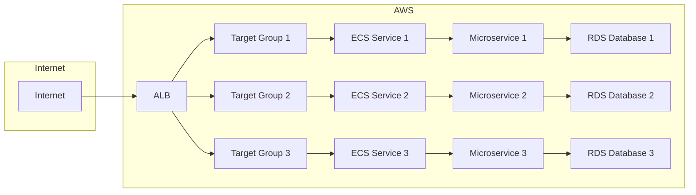

**8. Key Considerations:**

* **Containerization:** Package your microservices as Docker images for easy deployment and portability.
* **Monitoring:** Use Amazon CloudWatch to monitor your ECS cluster, ALB, and RDS instances.
* **Logging:** Use AWS CloudWatch Logs or a centralized logging solution to collect and analyze logs from your microservices.
* **Security:** Implement appropriate security measures, such as security groups, IAM roles, and secrets management.

#### Cloud Infrastructure : Kubernetes Example 

While the previous example showcased AWS ECS, Kubernetes offers a powerful and widely adopted alternative for container orchestration. This example demonstrates how to deploy the application using Kubernetes, which can be deployed on various cloud providers (AWS, Azure, GCP) or on-premises.

**1. Kubernetes Cluster**

* **Cluster Setup:** Create a Kubernetes cluster. You can use a managed Kubernetes service like Amazon EKS, Azure Kubernetes Service (AKS), Google Kubernetes Engine (GKE), or set up a self-managed cluster.
* **Nodes:**  Provision worker nodes within your cluster. Choose appropriate instance types/sizes based on your application's resource requirements.

**2. Deployments**

* **Deployments:** Create three Kubernetes deployments, one for each microservice (OBS, DAS, PRS). Each deployment will manage the deployment and scaling of its corresponding microservice.
* **Pods:** Each deployment will create pods, which are the smallest deployable units in Kubernetes. Each pod will contain a container running the microservice.
* **Replicas:** Specify the desired number of replicas (pods) for each deployment to ensure high availability and fault tolerance.

**3. Services**

* **Services:** Create three Kubernetes services, one for each microservice.  Services provide a stable network endpoint for accessing your pods, even as they are dynamically created and destroyed.
* **Service Types:** Use the `LoadBalancer` service type for your microservices. This will provision a load balancer (e.g., an AWS Elastic Load Balancer if running on AWS) that distributes traffic to the pods.

**4. Ingress**

* **Ingress:**  Use an Ingress controller to manage external access to your services. The Ingress controller will route traffic to the appropriate service based on the request path or other rules.

**5. Persistent Storage**

* **Persistent Volumes:**  If your microservices require persistent storage, create Persistent Volumes (PVs) to provide storage that persists independently of pods.
* **Persistent Volume Claims:**  Have your deployments create Persistent Volume Claims (PVCs) to request and mount the PVs.

**6. Scaling**

* **Horizontal Pod Autoscaler (HPA):** Configure HPAs for your deployments to automatically scale the number of pods based on CPU utilization, memory usage, or other metrics.

**7. Service Discovery**

* **Kubernetes Service Discovery:** Kubernetes provides built-in service discovery. Services can discover each other using their service names.

**8. Simplified Diagram:**

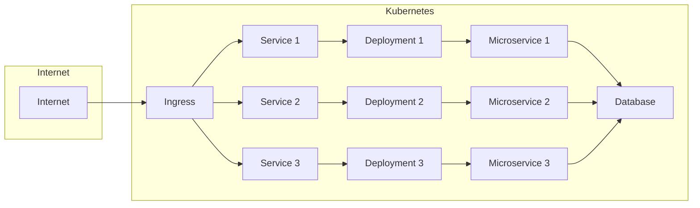

**9. Key Considerations:**

* **Containerization:** Package your microservices as Docker images.
* **Monitoring:** Use Kubernetes monitoring tools (e.g., Prometheus) to monitor your cluster and applications.
* **Logging:**  Use a centralized logging system to collect and analyze logs from your pods.
* **Security:** Implement security best practices, such as network policies, role-based access control (RBAC), and secrets management.

### 7.3 CI/CD Pipelines

The CI/CD pipeline for DAS employs a robust and automated workflow to streamline the building and testing of the application. This approach ensures rapid and reliable delivery of updates while maintaining high code quality and minimizing manual intervention. The pipeline utilizes a GitOps approach for deployment, which will be elaborated upon in the following section.

#### Build Pipelines Fundamentals

*   **Pipeline Overview:** The pipeline is designed to optimize the development process for DAS, a Spring Boot application with an RDBMS backend. It leverages GitHub as the source code repository and GitHub Actions for orchestrating the CI/CD workflow. The primary goals are to accelerate release cycles, increase deployment frequency, improve code quality, and reduce manual effort.
*   **Tools:** GitHub Actions forms the core of the CI/CD pipeline, providing a comprehensive platform for defining and executing automated workflows. It seamlessly integrates with GitHub's repository features and offers a wide range of actions for building, testing, and deploying applications.  Additional tools may include:
    *   Build tools for Spring Boot applications (e.g., Maven, Gradle)
    *   Testing frameworks (e.g., JUnit, Mockito)
    *   Code quality tools (e.g., SonarQube, Code Climate)
    *   Database migration tools (e.g., Flyway, Liquibase)
    *   Docker for containerization
*   **Build Stage:** Triggered by code commits or pull requests, the build stage compiles the DAS application code, runs any necessary pre-build steps (e.g., code generation), and packages the application into a Docker image. This image is then pushed to a secure container registry, such as AWS ECR, for later deployment.
*   **Test Stage:**  Automated tests are executed in parallel to validate the changes introduced in the build. This includes various levels of testing:
    *   **Unit Tests:** Verify individual components and methods within the application.
    *   **Integration Tests:**  Assess interactions between different modules and services.
    *   **End-to-End Tests:**  Simulate real-world scenarios and user interactions to ensure the application functions correctly as a whole.
    *   **Database Integration Tests:** Validate the application's interaction with the RDBMS, including data access and persistence operations.
    Any test failures halt the pipeline, preventing faulty code from being deployed.

#### Build Process Diagram

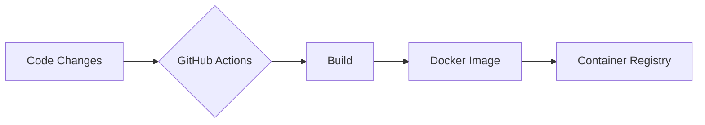

This diagram outlines the key steps in the build process:

*   **Code Changes:** Represents any modifications to the application's source code.
*   **GitHub Actions:**  Indicates that GitHub Actions is orchestrating the build process.
*   **Build:** Encompasses the compilation, testing, and packaging of the application.
*   **Docker Image:** Shows the creation of a Docker image containing the application.
*   **Container Registry:** Represents the storage of the Docker image in a registry (e.g., AWS ECR).

#### Deployment with GitOps

The deployment of DAS to the Kubernetes environment is managed using a GitOps approach. This involves storing all Kubernetes configuration files (deployments, services, etc.) in a Git repository, which serves as the single source of truth for the desired state of the application. A GitOps operator continuously monitors this repository and automatically applies any changes to the cluster. This pull-based deployment strategy enhances security and simplifies rollbacks. (Refer to the "GitOps in Kubernetes for DAS" section below for a detailed explanation.) 


#### Deployment Process Diagram (GitOps)

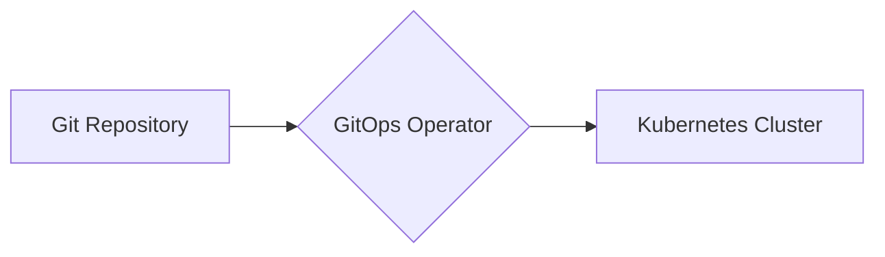

This diagram illustrates the GitOps deployment process:

*   **Git Repository:** Represents the Git repository containing the Kubernetes configuration files.
*   **GitOps Operator:**  Indicates the tool (e.g., Argo CD, Flux) that monitors the repository and applies changes.
*   **Kubernetes Cluster:** Shows the target environment where the application is deployed.

### 7.4 Monitoring Architecture

*   **Metrics Sources:**
    *   **Application Metrics:**  Gather key metrics from the DAS application itself, such as request latency, error rates, transaction throughput, and resource consumption (CPU, memory, threads).
    *   **Kubernetes Metrics:** Collect metrics from the Kubernetes cluster, including pod health, resource utilization (CPU, memory, network), and deployment status.
    *   **Database Metrics:** Monitor database performance, including query execution times, connection pool usage, and database server health.

*   **Monitoring Tools:**
    *   **CloudWatch:**  Utilize CloudWatch for collecting and visualizing system metrics, setting alarms for critical events, and creating dashboards for monitoring overall application health.
    *   **Prometheus:**  Employ Prometheus for collecting, storing, and querying time-series metrics, enabling advanced monitoring and alerting capabilities.

*   **Alerting:**
    *   **Threshold-based Alerts:** Configure alerts in CloudWatch or Prometheus to trigger notifications when specific metrics exceed predefined thresholds (e.g., high CPU utilization, low disk space).
    *   **Anomaly Detection:** Implement anomaly detection mechanisms to identify unusual patterns in metrics and trigger alerts for potential issues.

#### Illustative Diagram for Monitoring

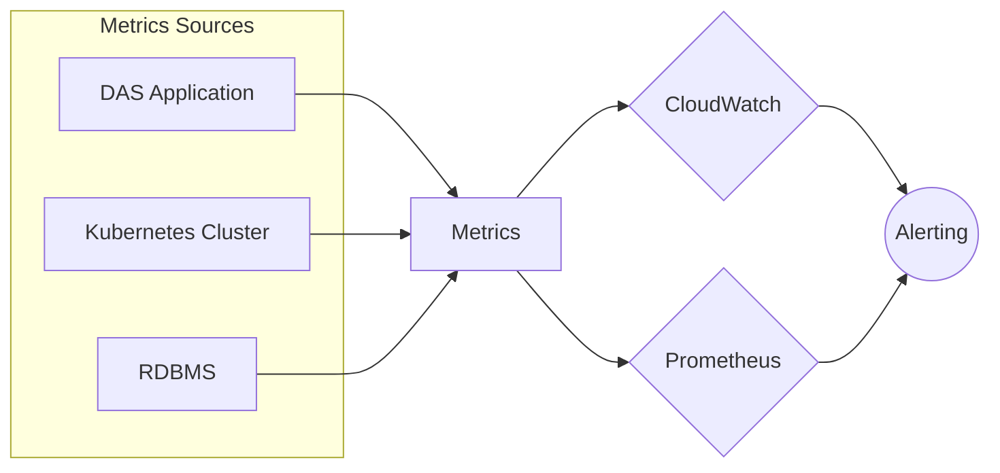

### 7.5 Logging Architecture

*   **Log Sources:**
    *   **Application Logs:** Capture logs generated by the DAS application, including information about API requests, database interactions, and internal events.
    *   **Kubernetes Logs:** Collect logs from Kubernetes components, such as pods, containers, and the control plane.
    *   **Database Logs:**  Gather logs from the database server, including error logs, query logs, and audit logs.

*   **Logging Tools:**
    *   **CloudWatch Logs:** Utilize CloudWatch Logs for collecting, storing, and analyzing log data.
    *   **ELK Stack (Elasticsearch, Logstash, Kibana):** Employ the ELK stack for centralized log management, providing advanced search, visualization, and analysis capabilities.

*   **Log Processing:**
    *   **Log Aggregation:**  Aggregate logs from all sources into a centralized location (CloudWatch Log Groups or Elasticsearch).
    *   **Log Parsing and Enrichment:** Parse log messages to extract relevant information and enrich them with additional context (e.g., timestamps, hostnames).
    *   **Log Analysis:**  Analyze log data to identify patterns, trends, and anomalies, and gain insights into application behavior and potential issues.

#### Illustrative Diagram for Logging

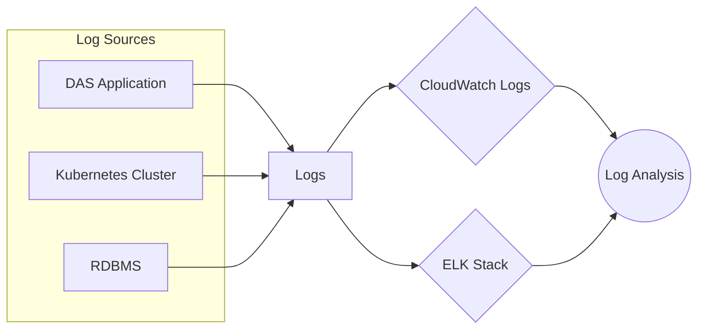

## 8. Cross-cutting Concepts

### 8.1 Security

#### 8.1.1 Security Architecture

Security in the DAS application is paramount and is built upon the following core principles:

*   **Decentralized and Declarative Access Control:** Access control is enforced directly within the service layer (e.g., `ledgers-account-service-impl`) and is entirely declarative. This means that access permissions are defined by associating accessor public keys with the resources they are allowed to access in a dedicated access control database. The presented credential serves as an attestation of this right, eliminating the need for real-time checks against the access database during authorization.

*   **Public Key-Based Authentication:**  DAS handles user authentication directly, relying on public key cryptography.  Accounts are linked to accessor public keys. Access is granted based on:
    *   **Signed Credentials (SD-JWT):** Issued by DAS to authenticated users, these credentials assert the user's identity and their associated public key.
    *   **Request Presentations:** For each request, the accessor must sign a presentation containing the request's hash. This presentation is included in the `Authorization` header.

*   **Request Signing and Verification:** DAS verifies the signature on the presentation to authenticate the requestor. This confirms that the request originates from the claimed accessor and hasn't been tampered with.

*   **Comprehensive Logging:** All requests, along with their associated presentations, are meticulously logged for auditing and security analysis. This creates a detailed audit trail for identifying potential security breaches or suspicious activities.

*   **Revocation Handling:**  A revocation database maintains a list of revoked credentials that haven't expired. This database is also held in memory for faster access, ensuring revoked credentials are promptly identified and rejected.

#### Diagram for Request Flow with Security

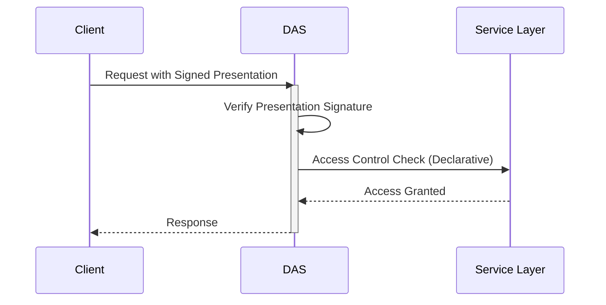
#### Diagram for Security Components
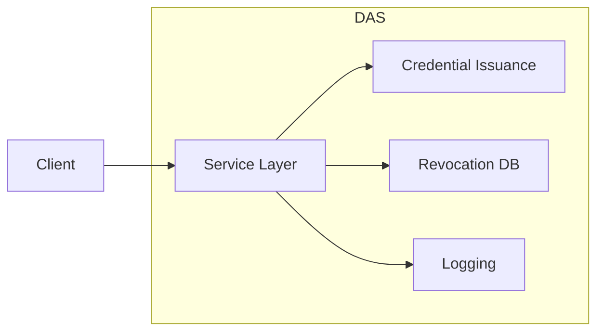

### 8.1.2 Data Encryption

Encryption remains crucial for protecting sensitive data:

*   **TLS/SSL for Transport Encryption:** All communication between clients and DAS, as well as inter-service communication, is secured using TLS/SSL to safeguard data in transit.
*   **Encryption at Rest:** Sensitive data in databases or persistent storage is encrypted to protect against unauthorized access in case of data breaches.

### 8.1.3 Static Code Analysis with SonarQube and GitHub Actions

**Scenario:**

You have a Java Spring Boot application built with Maven. You want to integrate SonarQube for static code analysis within your GitHub Actions workflow.

**Implementation:**

1. **SonarQube Setup:**
   - Set up a SonarQube server (either self-hosted or cloud-based).
   - Create a project in SonarQube for your application.
   - Generate a token in SonarQube for authentication.

2. **GitHub Actions Workflow:**

   ```yaml
   name: CI

   on:
     push:
       branches: [ main ]
     pull_request:
       branches: [ main ]

   jobs:
     build:
       runs-on: ubuntu-latest

       steps:
         - uses: actions/checkout@v3
           with:
             fetch-depth: 0 

         - name: Set up JDK 17
           uses: actions/setup-java@v3
           with:
             java-version: '17'
             distribution: 'temurin'
             cache: maven

         - name: Build and analyze with Maven
           env:
             SONAR_TOKEN: ${{ secrets.SONAR_TOKEN }} 
             SONAR_HOST_URL: ${{ secrets.SONAR_HOST_URL }}  
           run: |
             mvn -B verify org.sonarsource.scanner.maven:sonar-maven-plugin:sonar -Dsonar.projectKey=your-project-key
   ```

**Explanation:**

- **`actions/checkout@v3`:** Checks out your code from the repository. `fetch-depth: 0` ensures the full Git history is fetched, which is necessary for SonarQube to perform accurate analysis.
- **`actions/setup-java@v3`:** Sets up the Java environment.
- **`mvn -B verify ...`:**  
    - `-B` runs Maven in non-interactive (batch) mode.
    - `verify` runs all tests and produces code analysis reports.
    - `org.sonarsource.scanner.maven:sonar-maven-plugin:sonar` triggers the SonarQube analysis.
    - `-Dsonar.projectKey=your-project-key` specifies the project key in SonarQube.
- **Secrets:** The `SONAR_TOKEN` and `SONAR_HOST_URL` are stored as secrets in your GitHub repository settings.

**Benefits:**

- **Automated Code Analysis:**  SonarQube analyzes your code automatically on every push or pull request, providing immediate feedback on code quality and security issues.
- **Early Detection of Vulnerabilities:** SAST helps identify potential vulnerabilities early in the development process, making them easier and cheaper to fix.
- **Improved Code Quality:** SonarQube enforces coding standards and best practices, leading to more maintainable and reliable code.
- **GitHub Integration:**  Seamless integration with GitHub Actions provides a streamlined workflow.


### 8.1.4 Dynamic Code Analysis with OWASP ZAP and GitHub Actions

**Scenario:**

You want to use OWASP ZAP to perform dynamic security testing on your Spring Boot application deployed to a test environment.

**Implementation:**

1. **Test Environment:**
   - Deploy your Spring Boot application to a test environment (e.g., a staging server or a test Kubernetes cluster).

2. **GitHub Actions Workflow:**

   ```yaml
   name: DAST

   on:
     push:
       branches: [ main ]

   jobs:
     dast:
       runs-on: ubuntu-latest
       steps:
         - name: Run OWASP ZAP
           uses: zaproxy/action-baseline@v0.7.0
           with:
             target: ${{ secrets.TEST_APP_URL }}  # URL of your test application
             rules_file_name: '.zap/rules.tsv' # Optional: Custom rules file
             cmd_options: '-a' # Optional: Run in active scan mode

         - name: Upload ZAP report
           uses: actions/upload-artifact@v3
           with:
             name: zap-report
             path: ${{ github.workspace }}/zap-report/ 
   ```

**Explanation:**

- **`zaproxy/action-baseline@v0.7.0`:** This action runs OWASP ZAP.
   - `target`: Specifies the URL of your deployed application in the test environment.
   - `rules_file_name`: (Optional) Allows you to use a custom rules file for ZAP.
   - `cmd_options`: (Optional) Configures ZAP options, such as running in active scan mode (`-a`).
- **`actions/upload-artifact@v3`:** Uploads the generated ZAP report as an artifact in your GitHub Actions workflow run.

**Benefits:**

- **Automated Security Testing:**  OWASP ZAP automatically scans your running application for vulnerabilities, providing a comprehensive security assessment.
- **Realistic Attack Simulation:** DAST tools like ZAP simulate real-world attacks, helping you identify vulnerabilities that might be missed by static analysis.
- **Continuous Security:**  Integrate DAST into your CI/CD pipeline to ensure continuous security testing with every deployment to the test environment.
- **Detailed Reporting:** ZAP generates detailed reports that help you understand and address security vulnerabilities.


**Important Notes:**

- **Security Context:**  Ensure that your GitHub Actions runner has the necessary permissions to access your test environment and SonarQube server.
- **Customization:**  You can customize the ZAP scan configuration (e.g., authentication, attack mode) based on your application's needs.
- **False Positives:** DAST tools can sometimes generate false positives. Review the ZAP report carefully and validate any reported vulnerabilities.
- **Environment Variables:** Use environment variables or secrets to store sensitive information like API keys and URLs.

You're right to focus on security unit and integration tests and OWASP secure coding practices. Here's how you can implement them with concrete examples for your Java Spring Boot application:

### 8.1.5 Security for Unit and Integration Tests

* **Focus:**  Test security-critical aspects of your application's code.
* **Tools:** JUnit, Mockito, Spring Test

**Examples:**

* **Authentication and Authorization:**
    - Test that only authenticated users can access protected resources.
    - Verify that users have the correct permissions to perform actions (e.g., an admin can create users, but a regular user cannot).

    ```java
    @Test
    void testAccessProtectedResource_authenticatedUser_returns200() {
        // ... set up authenticated user ...

        mockMvc.perform(get("/protected-resource")
                .with(user("user").password("password").roles("USER")))
                .andExpect(status().isOk());
    }

    @Test
    void testAccessProtectedResource_unauthenticatedUser_returns401() {
        mockMvc.perform(get("/protected-resource"))
                .andExpect(status().isUnauthorized());
    }
    ```

* **Input Validation:**
    - Test that your application correctly validates user input to prevent injection attacks (e.g., SQL injection, Cross-Site Scripting).

    ```java
    @Test
    void testCreateUser_invalidInput_returnsBadRequest() {
        mockMvc.perform(post("/users")
                .contentType(MediaType.APPLICATION_JSON)
                .content("{\"username\": \"<script>alert('XSS')</script>\"}"))
                .andExpect(status().isBadRequest());
    }
    ```

* **Data Sanitization:**
    - Test that your application correctly sanitizes data before displaying it to prevent Cross-Site Scripting (XSS) attacks.

    ```java
    @Test
    void testDisplayUserData_sanitizesOutput() {
        // ... set up user with potentially malicious input ...

        mockMvc.perform(get("/user/123"))
                .andExpect(content().string(containsString("&lt;script&gt;alert('XSS')&lt;/script&gt;"))); // Escaped HTML
    }
    ```

* **Error Handling:**
    - Test that your application handles errors gracefully and doesn't reveal sensitive information in error messages.

    ```java
    @Test
    void testInvalidRequest_returnsGenericErrorMessage() {
        mockMvc.perform(get("/invalid-endpoint"))
                .andExpect(status().isNotFound())
                .andExpect(content().string(not(containsString("Stacktrace")))); // Avoid revealing stack traces
    }
    ```


### 8.1.6 Secure Coding Practices (OWASP)

* **Focus:** Follow OWASP guidelines to prevent common vulnerabilities.
* **Resources:** OWASP Cheat Sheets, OWASP Top Ten

**Examples:**

* **Input Validation:**
    - **Whitelist Validation:** Validate all user input against a whitelist of allowed characters and patterns.
    - **Contextual Encoding:** Encode data based on the context where it's used (e.g., HTML encoding for web pages, URL encoding for URLs).

    ```java
    String sanitizedInput = ESAPI.encoder().canonicalize(userInput); 
    // Use OWASP ESAPI (Enterprise Security API) for encoding and validation
    ```

* **Output Encoding:**
    - **Escape HTML:** Encode special characters in HTML output to prevent XSS.
    - **Use Parameterized Queries:** Use parameterized queries or prepared statements to prevent SQL injection.

    ```java
    String safeHtml = ESAPI.encoder().encodeForHTML(userData);

    // Use parameterized queries
    String query = "SELECT * FROM users WHERE username = ?";
    PreparedStatement statement = connection.prepareStatement(query);
    statement.setString(1, username); 
    ```

* **Authentication and Authorization:**
    - **Strong Passwords:** Enforce strong password policies (length, complexity).
    - **Multi-Factor Authentication (MFA):** Implement MFA for added security.
    - **Principle of Least Privilege:** Grant users only the necessary permissions.

    ```java
    // Use Spring Security for authentication and authorization
    @Configuration
    @EnableWebSecurity
    public class SecurityConfig extends WebSecurityConfigurerAdapter {
        // ... configure authentication and authorization rules ...
    }
    ```

* **Session Management:**
    - **Secure Cookies:** Use HTTPS to protect cookies in transit.
    - **HttpOnly Flag:** Set the HttpOnly flag on cookies to prevent client-side JavaScript from accessing them.
    - **Session Timeouts:** Implement session timeouts to prevent unauthorized access from inactive sessions.

    ```java
    @Configuration
    public class WebConfig implements WebMvcConfigurer {
        @Override
        public void addCookieOptions(CookieOptionsConfigurer configurer) {
            configurer.httpOnly(true)
                      .secure(true);
        }
    }
    ```


**Key Considerations:**

- **Security Libraries:** Use security libraries like OWASP ESAPI to help with input validation, output encoding, and other security tasks.
- **Code Reviews:**  Conduct regular code reviews to ensure that security best practices are being followed.
- **Security Training:** Provide security training to your development team to raise awareness of common vulnerabilities and secure coding practices.


### 8.1.7 Secrets Management

Protecting sensitive information like keys and credentials is crucial for application's security. Here's how we proceed in the DAS evironment:

**1. Key Management**

* **Secure Storage:**  Store SSL/TLS and other signature keys keys and other sensitive keys securely on the server. Use operating system-level mechanisms or dedicated key stores to protect these keys.
* **Key Rotation:** Implement a process for regularly rotating keys to limit the impact of a compromised key.  Spring Cloud Config Server can help with dynamic rotation.
* **Key Expiration:**  Monitor key expiration dates and ensure timely renewal to avoid service disruptions.

**2. Database Credentials**

* **Spring Cloud Config Server:** Use Spring Cloud Config Server to externalize database credentials (username, password) from your application code.
* **Environment Variables:** Inject database credentials into your application at runtime using environment variables. This allows you to change credentials without modifying your code.

**3. API Protection**

* **Client Credentials:**  Protect your APIs by requiring client applications to present credentials (e.g., API keys, OAuth tokens).
* **Spring Security:** Use Spring Security to implement authentication and authorization mechanisms for your APIs.

**4. Denial of Service Prevention**

* **Caching:** Cache mobile phone numbers used for registration to prevent denial-of-service attacks by limiting registration attempts from the same number.
* **Rate Limiting:** Implement rate limiting to restrict the number of requests from a particular IP address or user within a specific time frame.

**5. Spring Cloud Config Server Setup**

Spring Cloud Config Server provides a centralized way to manage your application's configuration, including secrets. Here's how to set it up:

* **Dependency:** Add the Spring Cloud Config Server dependency to your project:

   ```xml
   <dependency>
       <groupId>org.springframework.cloud</groupId>
       <artifactId>spring-cloud-config-server</artifactId>
   </dependency>
   ```

* **Enable Config Server:** Annotate your main application class with `@EnableConfigServer`:

   ```java
   @SpringBootApplication
   @EnableConfigServer
   public class ConfigServerApplication {
       public static void main(String[] args) {
           SpringApplication.run(ConfigServerApplication.class, args);
       }
   }
   ```

* **Configuration:** Configure the server to fetch configuration from a Git repository (or other sources):

   ```yaml
   spring:
     cloud:
       config:
         server:
           git:
             uri: https://github.com/your-org/your-config-repo 
             # ... other Git properties ...
   ```

* **Security:** Secure your Config Server using Spring Security to protect your configuration data.

* **Client Integration:** In your client applications, add the Spring Cloud Config Client dependency and configure it to fetch configuration from the Config Server.

**Example (Environment Variables):**

In your Spring Boot application, you can access environment variables using the `@Value` annotation:

```java
@Value("${database.username}")
private String dbUsername;

@Value("${database.password}")
private String dbPassword;
```

Then, you can set these environment variables on your server (e.g., in your deployment environment or using a tool like Docker Compose).

**Benefits of this Approach:**

* **Portability:** This solution focuses on portable techniques (environment variables, Spring Cloud Config Server) that can be used across different cloud providers or on-premises.
* **Security:** Keys are stored securely, credentials are externalized, and APIs are protected.
* **Flexibility:** Spring Cloud Config Server allows you to manage your configuration and secrets from a central location and easily update them without redeploying your applications.

### 8.1.8 Container Image Security

Container images are the building blocks of your application in a containerized environment. Ensuring their security is crucial to prevent vulnerabilities from making their way into your deployments.

* **Image Scanning**

    * **Tools:** Integrate image scanning tools like Anchore, Clair, or Trivy into your CI/CD pipeline. These tools analyze your container images for:
        * **Known Vulnerabilities:**  They check for vulnerabilities in the operating system packages, libraries, and other dependencies included in your image.
        * **Misconfigurations:** They identify potential security misconfigurations in the image (e.g., insecure user permissions, exposed ports).
        * **Secrets:** They detect any sensitive information (passwords, API keys) that might have been accidentally included in the image.

    * **Implementation:**
        * **CI/CD Integration:** Include image scanning as a stage in your CI/CD pipeline. This ensures that every image built is automatically scanned for vulnerabilities before it's deployed.
        * **Scanning Frequency:** Scan images regularly, even those already in production, as new vulnerabilities are discovered constantly.
        * **Vulnerability Database:**  Ensure your scanning tool uses an up-to-date vulnerability database.

* **Image Signing**

    * **Purpose:**  Image signing provides a way to verify the authenticity and integrity of your container images. It helps ensure that the image you're deploying is the one you built and hasn't been tampered with.
    * **Tools:**  Use tools like Docker Content Trust (DCT) or Sigstore (Cosign) to sign your images.
    * **Implementation:**
        * **Sign on Build:** Sign your images during the build process.
        * **Verify on Deployment:** Configure your container orchestration platform (Kubernetes, Docker Swarm) to verify image signatures before deploying containers.


### 8.1.9 Infrastructure as Code (IaC) Security

Infrastructure as Code (IaC) allows you to define and manage your infrastructure in a declarative way using code. However, IaC templates can also contain security misconfigurations.

* **IaC Scanning**

    * **Tools:** Use IaC scanning tools like Checkov, Terrascan, or tfsec to analyze your IaC templates (Terraform, CloudFormation) for security issues. These tools can detect:
        * **Insecure Configurations:**  Misconfigured security groups, open ports, lack of encryption.
        * **Compliance Violations:**  Violations of security standards like CIS Benchmarks or PCI DSS.
        * **Infrastructure Drift:**  Deviations from your defined IaC templates that might introduce security risks.

    * **Implementation:**
        * **CI/CD Integration:**  Integrate IaC scanning into your CI/CD pipeline to scan your templates before deploying infrastructure.
        * **Policy as Code:** Define security policies as code and use tools like Open Policy Agent (OPA) to enforce them across your IaC.

**Example (Trivy and Checkov)**

* **Trivy:**

   ```bash
   trivy image your-image-name:latest
   ```

* **Checkov:**

   ```bash
   checkov -d . 
   ```

**Key Considerations:**

* **Shift-Left Security:** Integrate these security checks early in your development process to identify and address issues before they reach production.
* **Automation:** Automate image scanning and IaC scanning in your CI/CD pipeline to ensure consistent security checks.
* **Security Policies:** Define clear security policies for your container images and infrastructure and enforce them using scanning tools and policy-as-code frameworks.

### 8.1.10 Vulnerability Management

Vulnerability management is an ongoing process of identifying, assessing, prioritizing, and remediating security vulnerabilities in your systems and applications. It's a continuous cycle that helps you proactively address security risks.

* **Continuous Monitoring**

    * **Purpose:**  Continuously monitor your environment for new vulnerabilities, security threats, and suspicious activity.
    * **Tools:**
        * **Security Information and Event Management (SIEM):**  Collect and analyze security logs from various sources (servers, firewalls, applications) to detect anomalies and security incidents.
        * **Intrusion Detection/Prevention Systems (IDS/IPS):**  Monitor network traffic for malicious activity and block or alert on suspicious patterns.
        * **Cloud Security Monitoring:**  Use cloud-provider specific tools (e.g., AWS Security Hub, Azure Security Center) to monitor your cloud resources for vulnerabilities and misconfigurations.

* **Vulnerability Scanning**

    * **Purpose:**  Regularly scan your infrastructure and applications to identify known vulnerabilities.
    * **Tools:**
        * **Nessus, Qualys:**  Comprehensive vulnerability scanners that can scan a wide range of systems and applications.
        * **OpenVAS:**  An open-source vulnerability scanner.
        * **Specialized Scanners:**  Use specialized scanners for specific technologies (e.g., web application scanners, database scanners).

    * **Implementation:**
        * **Scheduled Scans:**  Run vulnerability scans on a regular schedule (e.g., weekly, monthly).
        * **Triggered Scans:**  Trigger scans after significant events (e.g., deployments, configuration changes).
        * **Scope:**  Define the scope of your scans to include all relevant systems and applications.

* **Penetration Testing**

    * **Purpose:** Simulate real-world attacks to identify vulnerabilities that automated tools might miss.
    * **Types:**
        * **Black Box Testing:**  Testers have no prior knowledge of your systems.
        * **White Box Testing:**  Testers have full access to your system's architecture and code.
        * **Gray Box Testing:**  A combination of black box and white box testing.

    * **Implementation:**
        * **Frequency:**  Conduct penetration testing periodically (e.g., annually, bi-annually).
        * **Professional Services:**  Consider engaging professional penetration testing services for comprehensive assessments.


### 8.1.11 Security Training and Awareness

Your development team plays a crucial role in building secure applications. Investing in security training and awareness is essential to create a security-conscious culture.

* **Developer Training**

    * **Topics:**
        * **Secure Coding Practices:**  OWASP guidelines, input validation, output encoding, authentication, authorization.
        * **Security Technologies:**  Understanding security tools and technologies relevant to your applications (e.g., Spring Security, encryption libraries).
        * **Security Awareness:**  Recognizing common threats (phishing, social engineering) and best practices for protecting sensitive information.

    * **Methods:**
        * **Workshops:**  Conduct interactive workshops with hands-on exercises.
        * **Online Courses:**  Provide access to online security training courses.
        * **Lunch & Learns:**  Organize informal sessions to discuss security topics.

* **Security Champions**

    * **Role:** Identify individuals within your development team who are passionate about security and can act as security champions.
    * **Responsibilities:**
        * **Promote Security Awareness:**  Share security best practices, news, and updates with the team.
        * **Advocate for Security:**  Encourage the team to prioritize security in their work.
        * **Provide Guidance:**  Answer security-related questions and help the team address security concerns.

**Key Considerations:**

* **Prioritization:**  Prioritize vulnerabilities based on their severity and potential impact.
* **Remediation:**  Develop a process for remediating vulnerabilities in a timely manner.
* **Continuous Improvement:**  Regularly review and update your vulnerability management processes and security training programs.

### 8.2 Performance Optimization

This application, being a mobile online banking solution operating in a high-latency environment, demands stringent performance standards to ensure a satisfactory user experience.  The following performance goals and metrics will guide the optimization efforts and measure the success of those efforts.

#### 8.2.1 Performance Goals

* **Response Time:**
    * Balance inquiries:  Average response time under 1 second.
    * Transaction history: Average response time under 3 seconds.
    * Authentication: Average authentication time under 2 seconds.

* **Latency:**
    * 95th percentile latency for all key operations should meet the following targets:
        * Balance inquiries: Under 1.5 seconds.
        * Transaction history: Under 4 seconds.
        * Authentication: Under 1.5 seconds.

* **Error Rate:**
    * The system should maintain an error rate of less than 0.1% for all operations.

* **Resource Utilization:**
    * Average CPU utilization on servers should remain below 70% under normal load.

#### 8.2.2 Key Performance Metrics

The following metrics will be used to track and assess the system's performance:

* **Response Time:** The time taken for the application to respond to user requests.
* **Latency:** The delay in data transfer between the user's device and the servers.
* **Throughput:**  The number of transactions or requests processed per second.
* **Error Rate:** The percentage of failed requests or transactions.
* **Apdex Score:** A measure of user satisfaction based on response time thresholds.
* **Resource Utilization:** CPU usage, memory usage, network bandwidth, and other relevant server resource metrics.

#### 8.2.3 Measurement Tools

The following tools will be employed to measure and monitor the defined performance metrics:

* **Application Performance Monitoring (APM) Tools:** New Relic, Datadog, or Dynatrace will be used for comprehensive performance monitoring.
* **Load Testing Tools:** JMeter, LoadRunner, or Gatling will be used to simulate user traffic and conduct load testing.
* **Network Monitoring Tools:** Ping and Traceroute will be used to measure network latency and identify potential bottlenecks.


**Considerations for High Latency and Mobile Users:**

* The performance of the mobile app will be prioritized, given the lower tolerance for latency among mobile users.
* Data transfer between the app and the server will be minimized to mitigate the impact of high latency.
* Aggressive caching strategies will be implemented to reduce the frequency of network requests.
* The possibility of incorporating offline functionality in the app will be explored.
* Clear feedback mechanisms will be provided to users to keep them informed about the progress of their requests.

This approach ensures that performance optimization is treated as a first-class concern, with clear goals, metrics, and measurement strategies in place.

### 8.3 Database Optimization

Database performance is paramount in ensuring a responsive and scalable application. Several strategies are employed to optimize database interactions and minimize latency.

#### 8.3.1 Minimizing Database Access

The application is designed to reduce database access whenever possible. This is achieved through the following approaches:

* **In-Memory Balance Storage:** The list of all account balances is held in memory, eliminating the need for frequent database lookups for balance inquiries.
* **Primary Key Access:**  Database records are accessed directly through their primary keys, avoiding complex searches and minimizing query execution time.
* **Externalized Primary Keys:** Primary keys of main records are externalized to users and included in most requests. This eliminates the need for database searches based on other attributes.
* **Credential-Based Access Control:** Access control is built on signed credentials, removing the requirement to look up access permissions in the database before serving a request.
* **In-Memory Revocation:** Revocation lists are held in memory, enabling fast and efficient access control checks without database interaction.

#### 8.3.2 Database Design and Partitioning

* **Optimized Schema:** The database schema is designed with performance in mind, using appropriate data types and indexing strategies for frequently queried columns.
* **Horizontal Partitioning:** Externalized primary keys facilitate horizontal partitioning of the database. This enables distributing data across multiple database servers, significantly enhancing scalability and performance.

#### 8.3.3 Query Optimization

Database queries are carefully analyzed and optimized to ensure minimal execution time. Query profilers are used to identify and optimize slow-performing queries.

#### 8.3.4 Caching

Caching strategies are implemented to further reduce the number of database queries. A distributed caching layer, such as Redis or Memcached, is employed to cache frequently accessed data and improve response times.

These database optimization strategies contribute significantly to the application's overall performance, scalability, and responsiveness, particularly in a high-latency environment.

### 8.4 Application Code Optimization

Efficient application code is fundamental to achieving high performance. This section outlines the strategies employed to optimize the application's codebase and minimize resource consumption.

#### 8.4.1 Efficient Algorithms and Data Structures

The application leverages efficient algorithms and data structures to minimize computational complexity and ensure optimal performance.  This includes careful selection of data structures based on access patterns and the use of algorithms with low time and space complexity. For example:

* **Hash Maps for Fast Lookups:** Hash maps are used extensively for efficient retrieval of data based on keys, such as retrieving account information using account IDs.
* **Optimized Collections:**  Appropriate Java Collections Framework classes (e.g., `ArrayList`, `LinkedList`, `HashSet`) are chosen based on the specific needs of each use case.
* **Algorithm Selection:**  Algorithms are selected and implemented with consideration for their time and space complexity, ensuring efficient processing of data.

#### 8.4.2 Code Profiling and Bottleneck Identification

Code profiling is an integral part of the development process. Profiling tools, such as Java VisualVM, JProfiler, or YourKit, are used to analyze CPU usage, memory allocation, and method call times. This helps identify performance bottlenecks and optimize critical code sections.

#### 8.4.3 Asynchronous Processing

Asynchronous processing is employed for non-critical tasks to avoid blocking the main thread and improve responsiveness. Spring's `@Async` annotation and Java's `CompletableFuture` are used to implement asynchronous operations, allowing the application to handle concurrent requests efficiently.

#### 8.4.4  Spring Boot Optimization Features

The application leverages Spring Boot's built-in optimization features, such as:

* **Lazy Initialization:**  Spring beans are configured for lazy initialization to improve startup time and reduce memory consumption.
* **Connection Pooling:** Database connection pooling is used to minimize the overhead of establishing database connections.
* **Caching Abstractions:** Spring's caching abstractions are used to implement caching strategies efficiently.

These application code optimization techniques contribute significantly to the overall performance and responsiveness of the system.

### 8.5 Network Optimization

Efficient network communication is essential for optimal performance, especially in a microservices architecture and a high-latency environment. This section details the strategies employed to optimize network interactions.

#### 8.5.1 Minimizing Network Latency

Network latency is a key performance factor, particularly given the high-latency environment in which the application operates. To mitigate this, the following approaches are used:

* **Service Proximity:** Microservices are strategically deployed in close proximity to each other to reduce the physical distance over which data travels.
* **Efficient Routing:** Network routing is optimized to ensure efficient communication paths between services.
* **Connection Pooling:** Connection pooling is utilized to minimize the overhead of establishing new network connections for each request.

#### 8.5.2 Communication Protocol Selection

While JSON is the initial choice for inter-service communication due to its ease of use and readability, it is acknowledged that JSON may not be the most efficient protocol in terms of size.

* **JSON:**  JSON is used initially for its human-readability and ease of implementation.
* **CBOR Migration:** The system will migrate to CBOR (Concise Binary Object Representation) in the future to leverage its size efficiency and improve network performance. CBOR's binary encoding offers a more compact representation of data compared to JSON, resulting in faster transmission and reduced bandwidth consumption.

#### 8.5.3 Content Delivery Network (CDN)

Static content, such as images or JavaScript files, will be served through a Content Delivery Network (CDN). This distributes content closer to users, reducing latency and improving loading times.

These network optimization strategies, combined with the planned migration to CBOR, aim to create a responsive and efficient application even in challenging network conditions. By continuously evaluating and improving network communication, the system ensures smooth interactions between microservices and a seamless user experience.

### 8.6 Caching Strategies

Caching is a critical performance optimization technique, especially in applications that involve frequent data retrieval. This section describes the caching strategies employed to reduce latency and improve response times.

#### 8.6.1 Caching Layers

Caching is implemented at various layers of the application to maximize its effectiveness:

* **Client-Side Caching:** Data is cached directly in the user's mobile app. This minimizes network requests and allows for offline access to certain data.
    * **Storage:**  Utilize the mobile device's local storage (e.g., SQLite database, browser cache) to store frequently accessed data.
    * **Data Synchronization:** Implement mechanisms to synchronize cached data with the server when the device is online.

* **Server-Side Caching:** Frequently accessed data is cached on the server, reducing the need to query the database repeatedly.
    * **Spring Cache Abstraction:** Leverage Spring's caching abstraction (`@Cacheable`, `@CacheEvict`) to simplify server-side caching.
    * **In-Memory Caches:** Utilize in-memory caches (e.g., Ehcache, Caffeine) for fast data retrieval.

* **Distributed Caching:** A distributed cache, such as Redis or Memcached, is used to share cached data across multiple servers. This improves performance and scalability, especially in a clustered environment.
    * **Data Consistency:** Implement mechanisms to ensure data consistency across the distributed cache.

#### 8.6.2 Cache Invalidation

Appropriate cache invalidation strategies are crucial to maintain data consistency between the cache and the primary data source (database).

* **Time-Based Expiration:** Cache entries are set to expire after a specific duration.
* **Event-Driven Invalidation:** Cache entries are invalidated when relevant events occur (e.g., data updates, account changes).
* **Manual Invalidation:**  Provide mechanisms to manually invalidate cache entries when necessary.

#### 8.6.3 Caching Considerations

* **Data Freshness:** Balance the need for data freshness with the performance benefits of caching.
* **Cache Size:**  Configure appropriate cache sizes to avoid excessive memory consumption.
* **Cache Hit Ratio:** Monitor the cache hit ratio to measure the effectiveness of caching strategies.

By implementing these caching strategies, the application aims to significantly reduce data retrieval times, improve responsiveness, and enhance the overall user experience.

### 8.7 Load Testing and Performance Tuning

Load testing and performance tuning are essential practices to ensure the application can handle expected user traffic and maintain optimal performance under stress. This section outlines the approach to load testing and performance tuning.

#### 8.7.1 Load Testing

* **Realistic Simulation:** Load testing simulates real-world usage patterns by generating user traffic that mimics expected user behavior. This includes simulating various actions like user logins, balance inquiries, transaction history retrieval, and profile updates.
* **Tools:** Load testing tools such as JMeter, LoadRunner, or Gatling are used to generate realistic user loads and measure system performance under stress.
* **Metrics:** During load testing, key metrics are collected, including response times, latency, throughput, error rates, and resource utilization.
* **Bottleneck Identification:** Load testing helps identify performance bottlenecks in the application, database, or infrastructure. These bottlenecks can include slow database queries, inefficient code, or network limitations.

#### 8.7.2 Performance Tuning

* **Data-Driven Optimization:** Performance tuning is an iterative process based on the data gathered during load testing. Bottlenecks and areas for improvement are identified and addressed.
* **Application Code:**  Application code is analyzed and optimized to improve efficiency. This can involve refining algorithms, optimizing data structures, and minimizing resource consumption.
* **Database:** Database queries are analyzed and tuned for optimal performance. Indexing strategies are reviewed, and database configuration parameters are adjusted as needed.
* **Infrastructure:** Infrastructure components, such as servers, load balancers, and network configurations, are evaluated and adjusted to ensure they can handle the expected load.
* **Caching:** Caching strategies are reviewed and fine-tuned to maximize cache hit ratios and reduce database load.

This iterative process of load testing and performance tuning ensures that the application remains performant and scalable as user traffic grows. By continuously monitoring and optimizing the system, a high-quality user experience can be maintained even under peak load conditions.

### 8.8 Monitoring and Alerting

Continuous monitoring and alerting are vital for maintaining application performance and proactively addressing potential issues. This section outlines the strategies employed for performance monitoring and alerting.

#### 8.8.1 Performance Monitoring

* **Application Performance Monitoring (APM) Tools:** APM tools, such as New Relic, Datadog, Dynatrace, or Prometheus with Grafana, are used to continuously monitor the application's performance. These tools provide insights into various metrics, including:
    * Response times
    * Error rates
    * Request volumes
    * Resource utilization (CPU, memory, network)
    * Database performance
* **Custom Dashboards:**  Custom dashboards are created within the APM tools to visualize key performance indicators (KPIs) and track trends over time.

#### 8.8.2 Alerting

* **Threshold-Based Alerts:** Alerts are configured to trigger notifications when critical metrics exceed predefined thresholds. For example, alerts can be set for:
    * High error rates
    * Slow response times
    * Increased latency
    * High CPU or memory utilization
* **Notification Channels:** Alerts are delivered through various channels, such as email, Slack, or PagerDuty, to ensure timely responses to performance issues.
* **Automated Actions:** In some cases, alerts can trigger automated actions, such as scaling up server resources or restarting services, to mitigate performance degradation.


This proactive approach to monitoring and alerting enables the operations team to identify and address performance issues before they significantly impact users. By continuously tracking key metrics and receiving timely notifications, the team can ensure the application remains performant and reliable.


### 8.9 Error Handling

Robust error handling is essential to ensure the application's reliability and provide a positive user experience. This section describes the error handling mechanisms implemented throughout the system.

#### 8.9.1 Error Logging

* **Comprehensive Logging:**  All errors, exceptions, and warnings are logged with detailed contextual information. This includes timestamps, user IDs (if applicable), request details, and relevant stack traces.
* **Log Levels:** Log messages are categorized by severity levels (e.g., DEBUG, INFO, WARN, ERROR) to facilitate filtering and analysis.
* **Centralized Logging:** A centralized logging system is used to aggregate logs from all microservices and infrastructure components. This provides a unified view of system activity and facilitates troubleshooting.

#### 8.9.2 Error Monitoring and Alerting

* **Real-time Monitoring:**  Error logs are monitored in real-time to detect critical issues and trigger immediate responses.
* **Alerting:**  Alerts are generated for critical errors, such as service outages, database connection failures, or security breaches.
* **Notification Channels:** Alerts are delivered through various channels, including email, Slack, and PagerDuty, to ensure prompt attention from the operations team.

#### 8.9.3 Error Handling in API Responses

* **User-Friendly Messages:** Error responses in APIs are designed to provide informative and user-friendly error messages. These messages avoid technical jargon and guide users towards resolving the issue.
* **Error Codes:**  API responses include error codes that provide more specific information about the nature of the error.
* **Internationalization:** Error messages are internationalized to support different languages and locales.

#### 8.9.4 Error Recovery

* **Graceful Degradation:** The application is designed to degrade gracefully in the event of errors. Non-critical services may be temporarily unavailable, but core functionality should remain operational.
* **Retry Mechanisms:**  Retry mechanisms are implemented for transient errors, such as temporary network issues or service unavailability.
* **Circuit Breakers:** Circuit breakers are used to prevent cascading failures by isolating failing services and preventing repeated attempts to access them.

This comprehensive approach to error handling aims to ensure the application's robustness, minimize downtime, and provide a positive user experience even in the presence of errors.

## 9. Architecture Decisions
- **Layered Architecture**: For modularity and separation of concerns.
- **RESTful API**: Ensures broad compatibility with external services.
- **Data Encryption**: Mandatory for security and compliance with regulations.
- **GDPR Compliance**: User data is handled securely, respecting user privacy.
- **Access COntrol**: Add declarative and decentralized access control 

## 10. Quality Requirements
### Functional Requirements
- Account Registration, Balance Inquiry, and Transaction History retrieval.

### Non-Functional Requirements
- **Performance**: Low-latency responses.
- **Security**: Strong encryption and user data protection.
- **Usability**: User-friendly API design.

## 11. Risks and Technical Debt
- **Risks**: Includes data breach concerns and potential performance bottlenecks with high transaction volume.
- **Technical Debt**: Service module refactoring as DAS scales, and integration challenges with legacy systems.

## 12. Product Management
### Technology Stack
DAS is developed with Java, Spring Boot, ReactJS, TypeScript, TailwindCSS, AWS, Kubernetes, and Keycloak for a robust and secure environment.

## 13. Glossary
- **DAS**: Deposit Account Service
- **OBS**: Online Banking Service
- **PRS**: Person Registration Service
