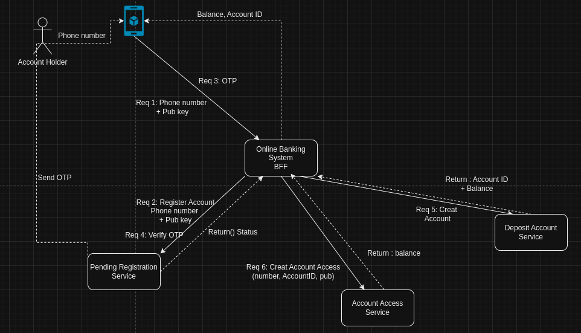

# Deposit Account Service (DAS) - ARC42 Architecture Documentation

## Table of Contents
1. [Introduction](#introduction)
2. [Architecture Constraints](#architecture-constraints)
3. [System Scope and Context](#system-scope-and-context)
4. [Solution Strategy](#solution-strategy)
5. [Building Block View](#building-block-view)
6. [Runtime View](#runtime-view)
7. [Deployment View](#deployment-view)
8. [Cross-cutting Concepts](#cross-cutting-concepts)
9. [Architecture Decisions](#architecture-decisions)
10. [Quality Requirements](#quality-requirements)
11. [Risks and Technical Debt](#risks-and-technical-debt)
12. [Product Management](#product-management)
13. [Glossary](#glossary)
14. [Appendix](#appendix)

## 1. Introduction
### Document Goals
This document provides a structured technical overview of the Deposit Account Service (DAS) using the ARC42 template. Its purpose is to support stakeholders, architects, and developers in understanding the architecture and design choices of the DAS module.

### Stakeholders
- **Product Managers**: Define functional and business requirements.
- **Development Teams**: Implement and maintain the service.
- **Security and Compliance Teams**: Ensure GDPR and regulatory compliance.
- **Operations**: Manage deployment, scalability, and monitoring.

## 2. Architecture Constraints
### Regulatory Constraints
- **GDPR Compliance**: Ensures data privacy and protection for users.
- **Financial Regulations**: Aligns with relevant financial regulatory standards for transaction handling and auditing.

### Technical Constraints
- **Data Encryption**: Sensitive data is encrypted both at rest and in transit.
- **Performance**: Must meet specific response time targets for balance inquiries and transaction history requests.

## 3. System Scope and Context
### Business Context
DAS is a backend module within a financial ecosystem, responsible for managing user accounts, balances, and transaction histories. It interfaces with the User Application, OBS (Online Banking Service), and AAS (Account Access Service).

### External Interfaces
- **User Interface**: Provides access for end-users to manage accounts and view balances.
- **Other Services**: Interfaces with OBS and AAS to handle tasks like balance inquiries and transaction retrievals.

## 4. Solution Strategy
DAS utilizes a layered architecture for clear separation of concerns, modularity, and scalability.

- **API Layer**: Exposes RESTful endpoints for external interactions.
- **Service Layer**: Processes business logic for account registration, balance inquiries, and transaction history.
- **Data Layer**: Manages data access, encryption, and storage.

## 5. Building Block View
### Overview
The DAS module is composed of three main components:
- **Account Registration**: Manages account creation and data validation.
- **Balance Inquiry**: Handles real-time balance retrieval.
- **Transaction History**: Logs, retrieves, and filters transaction data.

### Detailed View
- **API Layer**: Communicates with users and other services.
- **Service Layer**: Contains business logic for account management.
- **Data Layer**: Manages interactions with the database for account and transaction data.
 

## 6. Runtime View
### Balance Inquiry Scenario
1. The App sends a balance request to OBS.
2. OBS validates the account with AAS.
3. AAS retrieves the account ID and forwards it to DAS.
4. DAS returns the balance through AAS and OBS to the App.

### Key Scenarios
- **Account Registration**: User initiates account creation, and the system validates, stores, and confirms data.
- **Transaction History Retrieval**: User requests a filtered transaction history, which DAS retrieves accordingly.

## 7. Deployment View
### Deployment Strategy
#### Cloud Infrastructure
- **Platform**: DAS is deployed on Amazon Web Services (AWS), which provides a reliable and scalable cloud environment with high availability and security.
- **Load Balancing**: AWS Elastic Load Balancing (ELB) distributes incoming application traffic across multiple instances to ensure availability and resilience. It automatically adjusts to traffic demands, which helps maintain optimal performance during peak usage.
- **Scaling**: AWS Auto Scaling is implemented to monitor system performance and automatically adjust capacity as needed, scaling up during high-demand periods and down when demand decreases. This ensures efficient use of resources and cost management.

#### Container Orchestration
- **Kubernetes (K8s)**: DAS is containerized and managed using Kubernetes, which facilitates automated deployment, scaling, and management of containerized applications.
- **Clusters and Nodes**: The Kubernetes cluster comprises multiple nodes that host the containerized microservices. Each service, such as the API Layer, Service Layer, and Data Layer, is deployed as a Kubernetes Pod.
- **Horizontal Pod Autoscaling**: Kubernetes enables Horizontal Pod Autoscaling (HPA) based on CPU or memory utilization, dynamically scaling the number of pods to meet current demand.
- **Service Discovery and Load Balancing**: Kubernetes services provide internal load balancing within the cluster and manage communication between pods, ensuring seamless and reliable inter-service communication.

#### CI/CD Pipelines
- **Pipeline Overview**: Continuous Integration and Continuous Deployment (CI/CD) pipelines are set up to automate building, testing, and deployment processes, reducing manual intervention and ensuring rapid, reliable delivery of updates.
- **Tools**: The CI/CD pipelines are configured with tools such as Jenkins, GitLab CI/CD, or GitHub Actions for automated workflows, integrating with AWS and Kubernetes for seamless deployment.
- **Build Stage**: The pipeline triggers builds upon code commits or pull requests, creating Docker images for each service in DAS and pushing them to a secure container registry (e.g., AWS Elastic Container Registry (ECR)).
- **Test Stage**: Automated tests (unit, integration, and end-to-end) run in parallel to validate changes. Any failures stop the deployment process, ensuring only fully tested code reaches production.
- **Deployment Stage**: Upon passing all tests, Kubernetes deployments are triggered, and updated containers are rolled out. Kubernetes Rolling Updates ensure zero-downtime deployment by gradually replacing instances without affecting live traffic.

#### Monitoring and Logging
- **Monitoring**: Amazon CloudWatch and Prometheus are used for monitoring system performance, tracking key metrics (CPU, memory, request rates), and identifying any issues early. Kubernetes also provides native metrics for pod health and resource usage.
- **Logging**: AWS CloudWatch Logs or ELK Stack (Elasticsearch, Logstash, Kibana) captures and organizes logs for audit, security, and troubleshooting. Logs are centralized to provide insights across all microservices and help detect anomalies or performance bottlenecks.

## 8. Cross-cutting Concepts
### Security
- **Authentication and Authorization**: Keycloak provides user authentication and authorization services.
- **Data Encryption**: All sensitive data is encrypted in transit and at rest.
- **Access Control**: Role-based access control (RBAC) is enforced for sensitive data.

### Performance Optimization
- **Caching and Indexing**: Implemented for commonly accessed data, such as balances and transaction histories.

### Error Handling
- **Logging and Alerts**: All errors are logged, and alerts are generated for critical issues in real-time.

## 9. Architecture Decisions
- **Layered Architecture**: For modularity and separation of concerns.
- **RESTful API**: Ensures broad compatibility with external services.
- **Data Encryption**: Mandatory for security and compliance with regulations.
- **GDPR Compliance**: User data is handled securely, respecting user privacy.

## 10. Quality Requirements
### Functional Requirements
- Account Registration, Balance Inquiry, and Transaction History retrieval.

### Non-Functional Requirements
- **Performance**: Low-latency responses.
- **Security**: Strong encryption and user data protection.
- **Usability**: User-friendly API design.

## 11. Risks and Technical Debt
- **Risks**: Includes data breach concerns and potential performance bottlenecks with high transaction volume.
- **Technical Debt**: Service module refactoring as DAS scales, and integration challenges with legacy systems.

## 12. Product Management
### Technology Stack
DAS is developed with Java, Spring Boot, ReactJS, TypeScript, TailwindCSS, AWS, Kubernetes, and Keycloak for a robust and secure environment.

## 13. Glossary
- **DAS**: Deposit Account Service
- **OBS**: Online Banking Service
- **AAS**: Account Access Service
